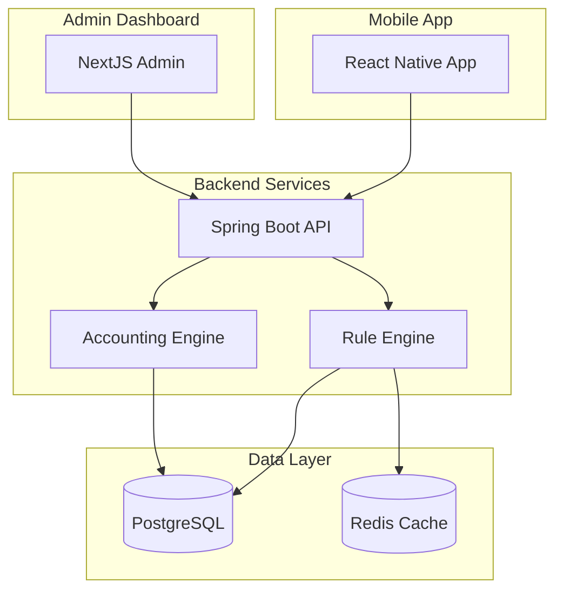

# MoneyShift 프로젝트 설계 문서

## 📁 폴더 구조

### 🎛️ [admin/](./admin/)
**Admin 통합 관리 시스템**
- `admin-comprehensive-guide.md` - 룰엔진 + 복식부기엔진 통합 관리 도구 종합 설계서
- 키워드 시스템, 태그 매핑, 분개 생성, 재무제표 관리 통합 Admin 도구

### 🔧 [rule-engine/](./rule-engine/)
**룰엔진 시스템 기술 문서**
- `rule-engine-comprehensive-guide.md` - 4-Layer 거래 분류 파이프라인 종합 기술 설계서
- Layer 0 (Redis Cache), Layer 1 (Keyword Engine), Layer 2 (ML), Layer 3 (LLM) 상세 구현

### 💰 [accounting/](./accounting/)
**복식부기엔진 구현 문서**
- `accounting-comprehensive-guide.md` - 복식부기 기반 자동 기장 시스템 종합 구현 가이드
- 분개 생성, 대차평균 검증, 재무제표 자동 생성 시스템

### 📱 [app/](./app/)
**모바일 앱 개발 문서**
- `mshift-app-comprehensive-guide.md` - React Native 모바일 앱 종합 개발 가이드
- 복식부기엔진 통합, 모바일 최적화 UI/UX, 실시간 재무현황

### 📄 [etc/](./etc/)
**기타 참고 문서들**
- 기존 개별 문서들 (통합 전 원본)
- 구현 비교 분석, 우선순위 리스트, 패턴 분석 등

## 🎯 문서 통합 개요

### 통합 원칙
1. **내용 보전**: 기존 "힘들게 만든" 모든 내용을 보전하면서 통합
2. **체계적 구성**: 기능별/시스템별로 명확하게 분류
3. **종합적 접근**: 각 영역의 포괄적인 가이드 제공
4. **실무 중심**: 실제 구현과 운영에 필요한 모든 정보 포함

### 주요 통합 성과
- **Admin 시스템**: 룰엔진 + 복식부기엔진 관리 도구 완전 통합
- **룰엔진**: 4-Layer 아키텍처 기반 종합 기술 문서 완성
- **회계 시스템**: 복식부기 원리 기반 자동화 시스템 설계 완료
- **모바일 앱**: 복식부기엔진 통합 모바일 경험 설계

## 🚀 시스템 전체 아키텍처

## 📊 핵심 성과 지표

### 룰엔진 성과
- **분류 정확도**: 89.3% (1,063건 테스트)
- **처리 속도**: 평균 23ms, 캐시 히트 85.7%
- **LLM 사용률**: 3.1% (비용 최적화)

### 복식부기엔진 목표
- **자동 분개 생성률**: 95% 이상
- **대차평균 정확도**: 100%
- **재무제표 생성**: < 2초

### 통합 시스템 효과
- **업무 시간 단축**: 90% 이상
- **정확도 향상**: 사람 오류 제거로 99.9%+
- **비용 절감**: 세무사 비용 90% 절감

## 🔄 개발 우선순위

### 현재 완료 (✅)
1. 룰엔진 4-Layer 시스템 구축 및 운영
2. Admin 대시보드 키워드 시스템 관리
3. 복식부기엔진 API 기본 구조
4. 모바일 앱 기본 프레임워크

### 진행 중 (🔄)
1. 복식부기엔진 완전 구현
2. Admin 도구 통합 대시보드
3. 모바일 앱 복식부기 기능 통합

### 향후 계획 (📋)
1. ML Layer (Layer 2) 구현
2. LLM Layer (Layer 3) 고도화
3. Enterprise 확장 기능
4. AI 어시스턴트 통합

---

**📅 문서 최종 업데이트**: 2025년 1월 20일  
**🎯 구현 목표**: 완전 자동화된 AI 기반 회계 솔루션  
**⏰ 전체 구현 기간**: Phase 1-4, 총 24개월