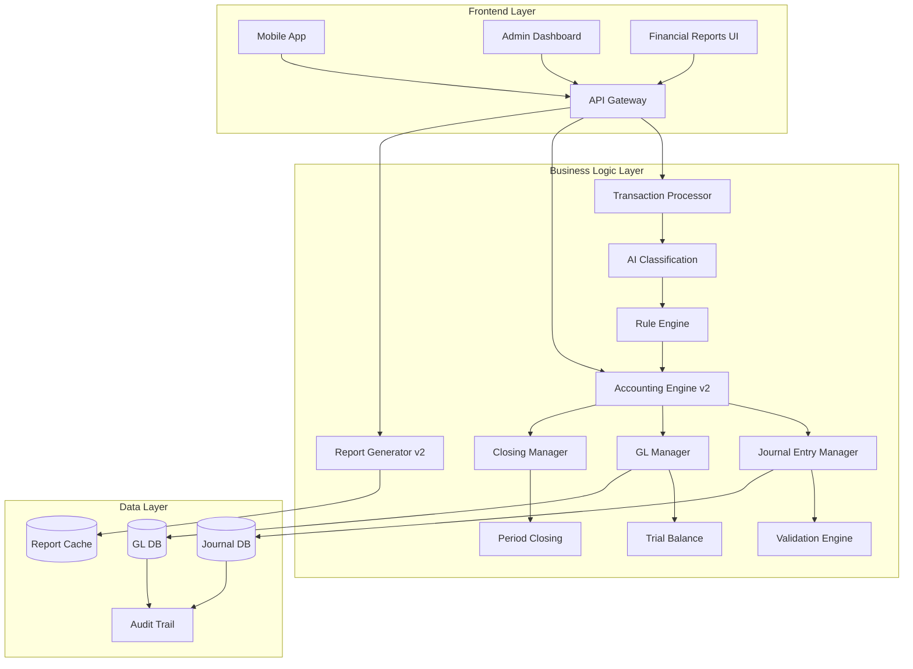

# MoneyShift 복식부기 시스템 통합 설계 문서 및 상세 PRD

**문서 버전**: 2.0  
**작성일**: 2025년 7월 24일  
**목적**: 경쟁사 수준의 재무제표 생성을 위한 완전한 시스템 설계

---

## 목차

1. [현황 분석 및 Gap 분석](#1-현황-분석-및-gap-분석)
2. [통합 아키텍처 설계](#2-통합-아키텍처-설계)
3. [상세 기능 명세](#3-상세-기능-명세)
4. [데이터베이스 확장 설계](#4-데이터베이스-확장-설계)
5. [핵심 비즈니스 로직](#5-핵심-비즈니스-로직)
6. [재무제표 생성 상세 설계](#6-재무제표-생성-상세-설계)
7. [UI/UX 상세 설계](#7-uiux-상세-설계)
8. [구현 로드맵](#8-구현-로드맵)

---

## 1. 현황 분석 및 Gap 분석

### 1.1 현재 시스템 분석

**구현 완료된 기능**:
- ✅ 기본 복식부기 엔진
- ✅ AI 기반 거래 분류 (4계층 파이프라인)
- ✅ 자동 분개 생성 (89.3% 자동 처리율)
- ✅ 기본 재무제표 생성 (대차대조표, 손익계산서)

**부족한 기능** (경쟁사 대비):
- ❌ 상세 계정과목 체계 (현재 30개 → 필요 200개+)
- ❌ 월별/분기별/연간 재무제표 비교
- ❌ 전표 형식의 분개 출력
- ❌ 세부 원장 관리 (총계정원장, 보조원장)
- ❌ 결산 및 마감 프로세스
- ❌ 세무 신고용 재무제표 형식
- ❌ 감사 추적 및 수정 이력 관리
- ❌ 다중 회계기준 지원 (K-GAAP, K-IFRS)

### 1.2 경쟁사 재무제표 분석

**Ledger-HR230610-00015-2025.pdf 주요 특징**:
1. **상세한 계정과목 분류**
   - 판매관리비 20개+ 세부 항목
   - 영업외수익/비용 세분화
   - 계정과목별 월별 추이 표시

2. **전문적인 재무제표 형식**
   - 표준 손익계산서 구조
   - 계층적 계정 표시 (I, II, III, IV...)
   - 소계 및 합계 자동 계산
   - 음수 표시 규칙 적용

3. **다기간 비교 기능**
   - 월별 컬럼으로 추이 분석
   - 당기/전기 비교
   - 누적 합계 표시

---

## 2. 통합 아키텍처 설계

### 2.1 시스템 전체 구조



### 2.2 모듈별 책임 및 인터페이스

| 모듈 | 책임 | 주요 인터페이스 |
|------|------|----------------|
| **Transaction Processor** | 거래 수집 및 전처리 | `processTransaction()`, `batchProcess()` |
| **AI Classification** | 거래 자동 분류 | `classifyTransaction()`, `getConfidence()` |
| **Accounting Engine v2** | 복식부기 핵심 로직 | `createJournal()`, `postToGL()`, `validateEntry()` |
| **Journal Entry Manager** | 분개 생성/관리 | `generateEntry()`, `reverseEntry()`, `approveEntry()` |
| **GL Manager** | 총계정원장 관리 | `updateLedger()`, `getBalance()`, `getTrialBalance()` |
| **Report Generator v2** | 재무제표 생성 | `generateBS()`, `generateIS()`, `generateCF()` |
| **Closing Manager** | 결산 및 마감 | `monthlyClosing()`, `yearEndClosing()` |

---

## 3. 상세 기능 명세

### 3.1 계정과목 관리 시스템

#### 3.1.1 확장된 계정과목 체계

```yaml
계정과목 구조:
  1000 자산
    1100 유동자산
      1110 당좌자산
        1111 현금
        1112 보통예금
        1113 당좌예금
        1114 정기예금
      1120 매출채권
        1121 외상매출금
        1122 받을어음
      1130 재고자산
        1131 상품
        1132 제품
        1133 원재료
    1200 비유동자산
      1210 유형자산
        1211 토지
        1212 건물
        1213 기계장치
        1214 차량운반구
        1215 비품
      1220 무형자산
        1221 영업권
        1222 특허권
        
  2000 부채
    2100 유동부채
      2110 매입채무
        2111 외상매입금
        2112 지급어음
      2120 단기차입금
      2130 미지급금
      2140 미지급비용
      2150 예수금
    2200 비유동부채
      2210 장기차입금
      2220 퇴직급여충당부채
      
  3000 자본
    3100 자본금
    3200 자본잉여금
    3300 이익잉여금
      3310 법정적립금
      3320 임의적립금
      3330 미처분이익잉여금
      
  4000 수익
    4100 매출
      4110 상품매출
      4120 제품매출
      4130 용역매출
    4200 영업외수익
      4210 이자수익
      4220 배당금수익
      4230 유형자산처분이익
      
  5000 비용
    5100 매출원가
      5110 상품매출원가
      5120 제품매출원가
    5200 판매비와관리비
      5201 급여
        5201-01 임원급여
        5201-02 직원급여
      5202 퇴직급여
      5203 복리후생비
      5204 여비교통비
      5205 접대비
      5206 통신비
      5207 수도광열비
      5208 세금과공과
      5209 감가상각비
      5210 지급임차료
      5211 수선비
      5212 보험료
      5213 차량유지비
      5214 운반비
      5215 교육훈련비
      5216 도서인쇄비
      5217 소모품비
      5218 지급수수료
      5219 광고선전비
      5220 경상연구개발비
    5300 영업외비용
      5310 이자비용
      5320 유형자산처분손실
```

#### 3.1.2 계정과목 관리 기능

```typescript
interface AccountManagement {
  // 계정과목 CRUD
  createAccount(account: ChartOfAccount): Promise<void>;
  updateAccount(accountCode: string, updates: Partial<ChartOfAccount>): Promise<void>;
  deactivateAccount(accountCode: string): Promise<void>;
  
  // 계정과목 계층 관리
  getAccountHierarchy(): Promise<AccountTree>;
  moveAccount(accountCode: string, newParentCode: string): Promise<void>;
  
  // 계정과목 매핑
  setDefaultMapping(tag: string, accountCode: string): Promise<void>;
  getAccountByTag(tag: string, context: TransactionContext): Promise<string>;
  
  // 계정과목 검증
  validateAccountCode(code: string): ValidationResult;
  checkAccountBalance(accountCode: string, date: Date): Promise<Balance>;
}
```

### 3.2 분개 관리 고도화

#### 3.2.1 복합 분개 지원

```typescript
interface ComplexJournalEntry {
  // 다중 차변/대변 지원
  id: string;
  entryDate: Date;
  description: string;
  lines: JournalLine[];
  attachments?: Attachment[];
  approvalStatus: ApprovalStatus;
  reversalInfo?: ReversalInfo;
}

interface JournalLine {
  lineNumber: number;
  accountCode: string;
  accountName: string;
  debitAmount: number;
  creditAmount: number;
  description?: string;
  costCenter?: string;
  project?: string;
  tags?: string[];
}
```

#### 3.2.2 분개 승인 워크플로

```yaml
승인 프로세스:
  1. 자동 생성 (신뢰도 > 90%)
     → 자동 승인 → GL 전기
     
  2. 중간 신뢰도 (70-90%)
     → 검토 대기 → 관리자 확인 → 승인/수정 → GL 전기
     
  3. 낮은 신뢰도 (< 70%)
     → 수동 입력 요청 → 담당자 입력 → 관리자 승인 → GL 전기
     
  4. 수정 분개
     → 원본 분개 역분개 → 새 분개 생성 → 승인 → GL 전기
```

### 3.3 총계정원장(GL) 관리

#### 3.3.1 원장 구조

```sql
-- 총계정원장
CREATE TABLE general_ledger (
    id BIGSERIAL PRIMARY KEY,
    company_id UUID NOT NULL,
    account_code VARCHAR(20) NOT NULL,
    fiscal_year INTEGER NOT NULL,
    fiscal_month INTEGER NOT NULL,
    
    -- 기초잔액
    beginning_debit_balance DECIMAL(18,2) DEFAULT 0,
    beginning_credit_balance DECIMAL(18,2) DEFAULT 0,
    
    -- 당월 발생
    period_debit_amount DECIMAL(18,2) DEFAULT 0,
    period_credit_amount DECIMAL(18,2) DEFAULT 0,
    
    -- 누계
    year_to_date_debit DECIMAL(18,2) DEFAULT 0,
    year_to_date_credit DECIMAL(18,2) DEFAULT 0,
    
    -- 기말잔액
    ending_debit_balance DECIMAL(18,2) DEFAULT 0,
    ending_credit_balance DECIMAL(18,2) DEFAULT 0,
    
    is_closed BOOLEAN DEFAULT FALSE,
    closed_at TIMESTAMPTZ,
    
    UNIQUE(company_id, account_code, fiscal_year, fiscal_month)
);

-- 원장 상세 (분개 전기 내역)
CREATE TABLE gl_details (
    id BIGSERIAL PRIMARY KEY,
    general_ledger_id BIGINT REFERENCES general_ledger(id),
    journal_entry_id BIGINT REFERENCES journal_entries(id),
    posting_date DATE NOT NULL,
    debit_amount DECIMAL(18,2) DEFAULT 0,
    credit_amount DECIMAL(18,2) DEFAULT 0,
    running_balance DECIMAL(18,2),
    description TEXT
);
```

#### 3.3.2 원장 전기 프로세스

```java
@Service
public class GeneralLedgerService {
    
    @Transactional
    public void postJournalToGL(Long journalEntryId) {
        JournalEntry journal = journalRepository.findById(journalEntryId);
        
        if (journal.getStatus() != JournalStatus.APPROVED) {
            throw new IllegalStateException("승인되지 않은 분개는 전기할 수 없습니다.");
        }
        
        for (JournalEntryDetail detail : journal.getDetails()) {
            // 1. GL 레코드 조회 또는 생성
            GeneralLedger gl = getOrCreateGLRecord(
                journal.getCompanyId(),
                detail.getAccountCode(),
                journal.getEntryDate()
            );
            
            // 2. GL 잔액 업데이트
            if (detail.getDebitAmount() > 0) {
                gl.setPeriodDebitAmount(gl.getPeriodDebitAmount() + detail.getDebitAmount());
                gl.setYearToDateDebit(gl.getYearToDateDebit() + detail.getDebitAmount());
            }
            
            if (detail.getCreditAmount() > 0) {
                gl.setPeriodCreditAmount(gl.getPeriodCreditAmount() + detail.getCreditAmount());
                gl.setYearToDateCredit(gl.getYearToDateCredit() + detail.getCreditAmount());
            }
            
            // 3. 기말잔액 재계산
            recalculateEndingBalance(gl);
            
            // 4. GL 상세 기록
            createGLDetail(gl, journal, detail);
        }
        
        // 5. 분개 상태 업데이트
        journal.setStatus(JournalStatus.POSTED);
        journal.setPostedAt(LocalDateTime.now());
    }
    
    private void recalculateEndingBalance(GeneralLedger gl) {
        ChartOfAccount account = accountRepository.findByCode(gl.getAccountCode());
        
        if (account.isDebitNormal()) {
            // 차변 정상 잔액 (자산, 비용)
            BigDecimal balance = gl.getBeginningDebitBalance()
                .add(gl.getPeriodDebitAmount())
                .subtract(gl.getPeriodCreditAmount());
                
            if (balance.compareTo(BigDecimal.ZERO) >= 0) {
                gl.setEndingDebitBalance(balance);
                gl.setEndingCreditBalance(BigDecimal.ZERO);
            } else {
                gl.setEndingDebitBalance(BigDecimal.ZERO);
                gl.setEndingCreditBalance(balance.negate());
            }
        } else {
            // 대변 정상 잔액 (부채, 자본, 수익)
            BigDecimal balance = gl.getBeginningCreditBalance()
                .add(gl.getPeriodCreditAmount())
                .subtract(gl.getPeriodDebitAmount());
                
            if (balance.compareTo(BigDecimal.ZERO) >= 0) {
                gl.setEndingCreditBalance(balance);
                gl.setEndingDebitBalance(BigDecimal.ZERO);
            } else {
                gl.setEndingCreditBalance(BigDecimal.ZERO);
                gl.setEndingDebitBalance(balance.negate());
            }
        }
    }
}
```

### 3.4 결산 및 마감 프로세스

#### 3.4.1 월 마감 프로세스

```typescript
interface MonthlyClosing {
  // 마감 전 검증
  validatePreClosing(companyId: string, yearMonth: string): ClosingValidation;
  
  // 마감 실행
  executeMonthlyClosing(companyId: string, yearMonth: string): ClosingResult;
  
  // 마감 검증 항목
  interface ClosingValidation {
    allTransactionsProcessed: boolean;
    allJournalsApproved: boolean;
    trialBalanceBalanced: boolean;
    reconciliationComplete: boolean;
    errors: ValidationError[];
  }
  
  // 마감 프로세스
  closingSteps: [
    "미처리 거래 확인",
    "미승인 분개 처리",
    "시산표 균형 검증",
    "계정 조정 완료",
    "손익계정 마감",
    "손익 이월",
    "재무제표 생성",
    "마감 잠금"
  ];
}
```

#### 3.4.2 연말 결산 프로세스

```java
@Service
public class YearEndClosingService {
    
    @Transactional
    public YearEndClosingResult executeYearEndClosing(String companyId, int fiscalYear) {
        // 1. 모든 월 마감 완료 확인
        validateAllMonthsClosed(companyId, fiscalYear);
        
        // 2. 결산 조정 분개
        List<JournalEntry> adjustmentEntries = createAdjustmentEntries(companyId, fiscalYear);
        
        // 3. 손익계정 마감
        closeRevenueAndExpenseAccounts(companyId, fiscalYear);
        
        // 4. 당기순이익 계산
        BigDecimal netIncome = calculateNetIncome(companyId, fiscalYear);
        
        // 5. 이익잉여금 이월
        transferToRetainedEarnings(companyId, netIncome);
        
        // 6. 차기 회계연도 개시
        initializeNewFiscalYear(companyId, fiscalYear + 1);
        
        // 7. 결산 재무제표 생성
        FinancialStatements statements = generateYearEndStatements(companyId, fiscalYear);
        
        return YearEndClosingResult.builder()
            .fiscalYear(fiscalYear)
            .netIncome(netIncome)
            .closedAt(LocalDateTime.now())
            .financialStatements(statements)
            .build();
    }
    
    private void closeRevenueAndExpenseAccounts(String companyId, int fiscalYear) {
        // 수익 계정 마감 (4xxx)
        List<GeneralLedger> revenueAccounts = glRepository.findByAccountCodePattern(
            companyId, "4%", fiscalYear);
            
        for (GeneralLedger gl : revenueAccounts) {
            BigDecimal balance = gl.getEndingCreditBalance().subtract(gl.getEndingDebitBalance());
            
            if (balance.compareTo(BigDecimal.ZERO) != 0) {
                // 손익 계정으로 대체
                JournalEntry closingEntry = JournalEntry.builder()
                    .description(String.format("%s 계정 마감", gl.getAccountName()))
                    .entryDate(LocalDate.of(fiscalYear, 12, 31))
                    .build();
                
                closingEntry.addLine(gl.getAccountCode(), balance, BigDecimal.ZERO);
                closingEntry.addLine("3330", BigDecimal.ZERO, balance); // 미처분이익잉여금
                
                journalService.createAndPost(closingEntry);
            }
        }
        
        // 비용 계정 마감 (5xxx) - 동일한 방식으로 처리
    }
}
```

---

## 4. 데이터베이스 확장 설계

### 4.1 추가 테이블 설계

```sql
-- 회계 기간 관리
CREATE TABLE fiscal_periods (
    id SERIAL PRIMARY KEY,
    company_id UUID NOT NULL,
    fiscal_year INTEGER NOT NULL,
    fiscal_month INTEGER NOT NULL,
    period_start DATE NOT NULL,
    period_end DATE NOT NULL,
    is_closed BOOLEAN DEFAULT FALSE,
    closed_at TIMESTAMPTZ,
    closed_by VARCHAR(100),
    UNIQUE(company_id, fiscal_year, fiscal_month)
);

-- 시산표
CREATE TABLE trial_balance (
    id BIGSERIAL PRIMARY KEY,
    company_id UUID NOT NULL,
    as_of_date DATE NOT NULL,
    account_code VARCHAR(20) NOT NULL,
    account_name VARCHAR(100) NOT NULL,
    debit_balance DECIMAL(18,2) DEFAULT 0,
    credit_balance DECIMAL(18,2) DEFAULT 0,
    adjustment_debit DECIMAL(18,2) DEFAULT 0,
    adjustment_credit DECIMAL(18,2) DEFAULT 0,
    adjusted_debit_balance DECIMAL(18,2) DEFAULT 0,
    adjusted_credit_balance DECIMAL(18,2) DEFAULT 0,
    generated_at TIMESTAMPTZ DEFAULT NOW()
);

-- 재무제표 템플릿
CREATE TABLE financial_statement_templates (
    id SERIAL PRIMARY KEY,
    template_name VARCHAR(100) NOT NULL,
    statement_type VARCHAR(50) NOT NULL, -- BS, IS, CF
    accounting_standard VARCHAR(20), -- K-GAAP, K-IFRS
    template_structure JSONB NOT NULL,
    is_active BOOLEAN DEFAULT TRUE
);

-- 계정과목 매핑 규칙
CREATE TABLE account_mapping_rules (
    id SERIAL PRIMARY KEY,
    rule_name VARCHAR(100) NOT NULL,
    tag_pattern VARCHAR(200),
    keyword_pattern VARCHAR(500),
    target_account_code VARCHAR(20) NOT NULL,
    priority INTEGER DEFAULT 100,
    conditions JSONB, -- 추가 조건 (금액, 시간, 빈도 등)
    confidence_score INTEGER DEFAULT 80,
    is_active BOOLEAN DEFAULT TRUE
);

-- 감사 추적
CREATE TABLE audit_trail (
    id BIGSERIAL PRIMARY KEY,
    entity_type VARCHAR(50) NOT NULL, -- JOURNAL, GL, STATEMENT
    entity_id BIGINT NOT NULL,
    action VARCHAR(50) NOT NULL, -- CREATE, UPDATE, DELETE, APPROVE, POST
    previous_value JSONB,
    new_value JSONB,
    changed_by VARCHAR(100) NOT NULL,
    changed_at TIMESTAMPTZ DEFAULT NOW(),
    ip_address VARCHAR(45),
    user_agent TEXT
);

-- 첨부 파일 관리
CREATE TABLE attachments (
    id BIGSERIAL PRIMARY KEY,
    entity_type VARCHAR(50) NOT NULL,
    entity_id BIGINT NOT NULL,
    file_name VARCHAR(255) NOT NULL,
    file_type VARCHAR(50),
    file_size BIGINT,
    storage_path TEXT,
    uploaded_by VARCHAR(100),
    uploaded_at TIMESTAMPTZ DEFAULT NOW()
);
```

### 4.2 인덱스 최적화

```sql
-- 성능 최적화 인덱스
CREATE INDEX idx_gl_company_account_period 
ON general_ledger(company_id, account_code, fiscal_year, fiscal_month);

CREATE INDEX idx_gl_details_posting_date 
ON gl_details(posting_date);

CREATE INDEX idx_journal_entries_composite 
ON journal_entries(company_id, entry_date, status);

CREATE INDEX idx_trial_balance_date 
ON trial_balance(company_id, as_of_date);

-- 텍스트 검색 인덱스
CREATE INDEX idx_journal_description_gin 
ON journal_entries USING gin(to_tsvector('korean', description));

-- 부분 인덱스 (조건부)
CREATE INDEX idx_journal_pending_approval 
ON journal_entries(company_id, created_at) 
WHERE status = 'PENDING_APPROVAL';
```

---

## 5. 핵심 비즈니스 로직

### 5.1 고급 분개 생성 규칙

#### 5.1.1 거래 유형별 분개 패턴

```typescript
class AdvancedJournalPatterns {
  // 신용카드 결제 (미지급금 사용)
  creditCardPayment(transaction: Transaction): JournalEntry {
    return {
      lines: [
        { accountCode: getExpenseAccount(transaction), debit: transaction.amount, credit: 0 },
        { accountCode: "2130", debit: 0, credit: transaction.amount } // 미지급금
      ]
    };
  }
  
  // 카드 대금 결제
  creditCardSettlement(amount: number, bankAccount: string): JournalEntry {
    return {
      lines: [
        { accountCode: "2130", debit: amount, credit: 0 }, // 미지급금 차감
        { accountCode: bankAccount, debit: 0, credit: amount } // 은행 출금
      ]
    };
  }
  
  // 선급비용 (월별 안분)
  prepaidExpense(totalAmount: number, months: number): JournalEntry[] {
    const monthlyAmount = totalAmount / months;
    const entries: JournalEntry[] = [];
    
    // 초기 선급
    entries.push({
      lines: [
        { accountCode: "1140", debit: totalAmount, credit: 0 }, // 선급비용
        { accountCode: "1120", debit: 0, credit: totalAmount } // 현금 지출
      ]
    });
    
    // 월별 비용 인식
    for (let i = 0; i < months; i++) {
      entries.push({
        lines: [
          { accountCode: getExpenseAccount(), debit: monthlyAmount, credit: 0 },
          { accountCode: "1140", debit: 0, credit: monthlyAmount } // 선급비용 차감
        ]
      });
    }
    
    return entries;
  }
  
  // 감가상각
  depreciation(asset: Asset): JournalEntry {
    const monthlyDepreciation = asset.cost / asset.usefulLifeMonths;
    
    return {
      lines: [
        { accountCode: "5209", debit: monthlyDepreciation, credit: 0 }, // 감가상각비
        { accountCode: asset.accumulatedDepAccount, debit: 0, credit: monthlyDepreciation }
      ]
    };
  }
}
```

#### 5.1.2 복잡한 거래 처리

```java
@Service
public class ComplexTransactionProcessor {
    
    // 급여 처리 (원천징수 포함)
    public List<JournalEntry> processSalary(SalaryData salary) {
        List<JournalEntry> entries = new ArrayList<>();
        
        // 급여 분개
        JournalEntry salaryEntry = JournalEntry.builder()
            .description("급여 지급 - " + salary.getEmployeeName())
            .build();
            
        // 급여비용
        salaryEntry.addLine("5201", salary.getGrossAmount(), 0);
        
        // 원천징수
        salaryEntry.addLine("2150", 0, salary.getIncomeTax()); // 예수금 - 소득세
        salaryEntry.addLine("2150", 0, salary.getResidentTax()); // 예수금 - 주민세
        salaryEntry.addLine("2150", 0, salary.getNationalPension()); // 예수금 - 국민연금
        salaryEntry.addLine("2150", 0, salary.getHealthInsurance()); // 예수금 - 건강보험
        
        // 실지급액
        salaryEntry.addLine("1120", 0, salary.getNetAmount()); // 보통예금
        
        entries.add(salaryEntry);
        
        // 4대보험 회사부담분
        JournalEntry insuranceEntry = JournalEntry.builder()
            .description("4대보험 회사부담분")
            .build();
            
        insuranceEntry.addLine("5203", salary.getCompanyPensionShare(), 0); // 복리후생비
        insuranceEntry.addLine("5203", salary.getCompanyHealthShare(), 0);
        insuranceEntry.addLine("2140", 0, salary.getCompanyPensionShare()); // 미지급비용
        insuranceEntry.addLine("2140", 0, salary.getCompanyHealthShare());
        
        entries.add(insuranceEntry);
        
        return entries;
    }
    
    // 매출 및 부가세 처리
    public JournalEntry processSalesWithVAT(SalesData sales) {
        BigDecimal supplyAmount = sales.getTotalAmount().divide(new BigDecimal("1.1"), 0, RoundingMode.DOWN);
        BigDecimal vatAmount = sales.getTotalAmount().subtract(supplyAmount);
        
        JournalEntry entry = JournalEntry.builder()
            .description("매출 - " + sales.getCustomerName())
            .build();
            
        // 매출채권
        entry.addLine("1121", sales.getTotalAmount(), BigDecimal.ZERO);
        
        // 매출
        entry.addLine("4110", BigDecimal.ZERO, supplyAmount);
        
        // 부가세예수금
        entry.addLine("2150", BigDecimal.ZERO, vatAmount);
        
        return entry;
    }
}
```

### 5.2 자동 매핑 고도화

#### 5.2.1 컨텍스트 기반 지능형 매핑

```typescript
class IntelligentAccountMapper {
  
  mapTransaction(transaction: Transaction): MappingResult {
    // 1. 기본 규칙 매핑
    let baseMapping = this.getBaseMapping(transaction.tag);
    
    // 2. 컨텍스트 분석
    const context = this.analyzeContext(transaction);
    
    // 3. 컨텍스트 기반 조정
    if (context.isLunchTime && transaction.tag === '음식점') {
      baseMapping = this.adjustForMealContext(baseMapping, context);
    }
    
    // 4. 과거 패턴 학습
    const historicalPattern = this.getHistoricalPattern(
      transaction.merchant,
      transaction.amount
    );
    
    // 5. 최종 결정
    return this.finalizeMapping(baseMapping, context, historicalPattern);
  }
  
  private analyzeContext(transaction: Transaction): TransactionContext {
    return {
      isBusinessHours: this.isBusinessHours(transaction.timestamp),
      isLunchTime: this.isLunchTime(transaction.timestamp),
      isDinnerTime: this.isDinnerTime(transaction.timestamp),
      isWeekend: this.isWeekend(transaction.timestamp),
      frequencyScore: this.getFrequencyScore(transaction.merchant),
      amountPattern: this.analyzeAmountPattern(transaction.amount),
      locationContext: this.getLocationContext(transaction.location)
    };
  }
  
  private adjustForMealContext(
    baseMapping: AccountMapping,
    context: TransactionContext
  ): AccountMapping {
    // 점심시간 + 소액 → 복리후생비
    if (context.isLunchTime && context.amountPattern === 'SMALL') {
      return {
        accountCode: '5203',
        accountName: '복리후생비',
        confidence: 0.85
      };
    }
    
    // 저녁시간 + 고액 → 접대비
    if (context.isDinnerTime && context.amountPattern === 'LARGE') {
      return {
        accountCode: '5205',
        accountName: '접대비',
        confidence: 0.75,
        requiresApproval: true
      };
    }
    
    return baseMapping;
  }
}
```

---

## 6. 재무제표 생성 상세 설계

### 6.1 손익계산서 생성 엔진

#### 6.1.1 계층적 구조 생성

```java
@Service
public class IncomeStatementGenerator {
    
    public IncomeStatement generateIncomeStatement(
        String companyId, 
        LocalDate startDate, 
        LocalDate endDate,
        boolean includeComparison
    ) {
        // 1. 기간 데이터 조회
        PeriodData currentPeriod = getPeriodData(companyId, startDate, endDate);
        PeriodData previousPeriod = null;
        
        if (includeComparison) {
            previousPeriod = getPreviousPeriodData(companyId, startDate, endDate);
        }
        
        // 2. 계층적 구조 생성
        IncomeStatement statement = new IncomeStatement();
        
        // I. 매출액
        statement.addSection(
            buildRevenueSection(currentPeriod.getRevenueAccounts(), previousPeriod)
        );
        
        // II. 매출원가
        statement.addSection(
            buildCOGSSection(currentPeriod.getCOGSAccounts(), previousPeriod)
        );
        
        // III. 매출총이익
        statement.addCalculatedLine(
            "매출총이익",
            statement.getSection("매출액").getTotal()
                .subtract(statement.getSection("매출원가").getTotal())
        );
        
        // IV. 판매비와관리비
        statement.addSection(
            buildOperatingExpenseSection(currentPeriod.getOperatingExpenses(), previousPeriod)
        );
        
        // V. 영업이익
        statement.addCalculatedLine(
            "영업이익",
            statement.getLine("매출총이익").getAmount()
                .subtract(statement.getSection("판매비와관리비").getTotal())
        );
        
        // VI. 영업외수익
        statement.addSection(
            buildNonOperatingIncomeSection(currentPeriod.getNonOperatingIncome(), previousPeriod)
        );
        
        // VII. 영업외비용
        statement.addSection(
            buildNonOperatingExpenseSection(currentPeriod.getNonOperatingExpense(), previousPeriod)
        );
        
        // VIII. 법인세차감전순이익
        BigDecimal pretaxIncome = statement.getLine("영업이익").getAmount()
            .add(statement.getSection("영업외수익").getTotal())
            .subtract(statement.getSection("영업외비용").getTotal());
            
        statement.addCalculatedLine("법인세차감전순이익", pretaxIncome);
        
        // IX. 법인세비용
        BigDecimal taxExpense = calculateCorporateTax(pretaxIncome);
        statement.addLine("법인세비용", taxExpense);
        
        // X. 당기순이익
        statement.addCalculatedLine(
            "당기순이익",
            pretaxIncome.subtract(taxExpense)
        );
        
        return statement;
    }
    
    private Section buildOperatingExpenseSection(
        List<AccountBalance> expenses,
        PeriodData previousPeriod
    ) {
        Section section = new Section("판매비와관리비");
        
        // 계정과목 순서대로 정렬
        expenses.sort(Comparator.comparing(AccountBalance::getAccountCode));
        
        for (AccountBalance expense : expenses) {
            LineItem item = new LineItem();
            item.setAccountCode(expense.getAccountCode());
            item.setAccountName(expense.getAccountName());
            item.setCurrentAmount(expense.getBalance());
            
            if (previousPeriod != null) {
                AccountBalance prevBalance = previousPeriod.getBalance(expense.getAccountCode());
                item.setPreviousAmount(prevBalance != null ? prevBalance.getBalance() : BigDecimal.ZERO);
                item.setChangeAmount(item.getCurrentAmount().subtract(item.getPreviousAmount()));
                item.setChangeRate(calculateChangeRate(item.getPreviousAmount(), item.getCurrentAmount()));
            }
            
            section.addLineItem(item);
        }
        
        return section;
    }
}
```

#### 6.1.2 월별 추이 분석

```typescript
interface MonthlyTrendAnalysis {
  generateMonthlyIS(
    companyId: string,
    year: number,
    months: number[]
  ): MonthlyIncomeStatement;
}

class MonthlyIncomeStatement {
  private data: Map<string, MonthlyData[]> = new Map();
  
  addAccountData(accountCode: string, monthlyBalances: MonthlyBalance[]) {
    this.data.set(accountCode, monthlyBalances);
  }
  
  getMonthlyTrend(accountCode: string): TrendAnalysis {
    const monthlyData = this.data.get(accountCode);
    
    return {
      average: this.calculateAverage(monthlyData),
      trend: this.calculateTrend(monthlyData),
      volatility: this.calculateVolatility(monthlyData),
      seasonality: this.detectSeasonality(monthlyData)
    };
  }
  
  exportToExcel(): Workbook {
    const wb = new ExcelJS.Workbook();
    const ws = wb.addWorksheet('월별 손익계산서');
    
    // 헤더 생성
    ws.addRow(['계정과목', '1월', '2월', ..., '12월', '합계', '평균']);
    
    // 데이터 행 추가
    this.data.forEach((monthlyData, accountCode) => {
      const row = [accountCode];
      monthlyData.forEach(data => row.push(data.amount));
      row.push(this.getTotal(accountCode));
      row.push(this.getAverage(accountCode));
      ws.addRow(row);
    });
    
    // 소계 및 합계 추가
    this.addSubtotals(ws);
    
    return wb;
  }
}
```

### 6.2 대차대조표 생성 엔진

#### 6.2.1 자산/부채/자본 구조화

```java
@Service
public class BalanceSheetGenerator {
    
    public BalanceSheet generateBalanceSheet(
        String companyId,
        LocalDate asOfDate,
        boolean includeDetails
    ) {
        // 1. 잔액 조회
        Map<String, BigDecimal> balances = getAccountBalances(companyId, asOfDate);
        
        // 2. 계정 체계별 분류
        BalanceSheet bs = new BalanceSheet();
        bs.setCompanyId(companyId);
        bs.setAsOfDate(asOfDate);
        
        // 자산 섹션
        AssetSection assets = new AssetSection();
        
        // 유동자산
        CurrentAssets currentAssets = new CurrentAssets();
        currentAssets.addAccount("현금및현금성자산", 
            sumAccounts(balances, "1111", "1112", "1113"));
        currentAssets.addAccount("매출채권", 
            sumAccounts(balances, "1121", "1122"));
        currentAssets.addAccount("재고자산", 
            sumAccounts(balances, "1131", "1132", "1133"));
        currentAssets.addAccount("기타유동자산", 
            sumAccounts(balances, "1140", "1150"));
        
        assets.setCurrentAssets(currentAssets);
        
        // 비유동자산
        NonCurrentAssets nonCurrentAssets = new NonCurrentAssets();
        
        // 유형자산
        TangibleAssets tangibleAssets = new TangibleAssets();
        tangibleAssets.addAccount("토지", getBalance(balances, "1211"));
        tangibleAssets.addAccount("건물", getBalance(balances, "1212"));
        tangibleAssets.addAccount("감가상각누계액(건물)", 
            getBalance(balances, "1212-1").negate());
        tangibleAssets.addAccount("기계장치", getBalance(balances, "1213"));
        tangibleAssets.addAccount("차량운반구", getBalance(balances, "1214"));
        tangibleAssets.addAccount("비품", getBalance(balances, "1215"));
        
        nonCurrentAssets.setTangibleAssets(tangibleAssets);
        
        // 무형자산
        IntangibleAssets intangibleAssets = new IntangibleAssets();
        intangibleAssets.addAccount("영업권", getBalance(balances, "1221"));
        intangibleAssets.addAccount("특허권", getBalance(balances, "1222"));
        
        nonCurrentAssets.setIntangibleAssets(intangibleAssets);
        
        assets.setNonCurrentAssets(nonCurrentAssets);
        bs.setAssets(assets);
        
        // 부채 섹션
        LiabilitySection liabilities = buildLiabilitySection(balances);
        bs.setLiabilities(liabilities);
        
        // 자본 섹션
        EquitySection equity = buildEquitySection(balances);
        bs.setEquity(equity);
        
        // 3. 균형 검증
        validateBalance(bs);
        
        return bs;
    }
    
    private void validateBalance(BalanceSheet bs) {
        BigDecimal totalAssets = bs.getAssets().getTotal();
        BigDecimal totalLiabilitiesAndEquity = 
            bs.getLiabilities().getTotal().add(bs.getEquity().getTotal());
            
        if (totalAssets.compareTo(totalLiabilitiesAndEquity) != 0) {
            BigDecimal difference = totalAssets.subtract(totalLiabilitiesAndEquity);
            
            throw new BalanceSheetImbalanceException(String.format(
                "대차대조표 불균형: 차이 = %s (자산: %s, 부채+자본: %s)",
                formatCurrency(difference),
                formatCurrency(totalAssets),
                formatCurrency(totalLiabilitiesAndEquity)
            ));
        }
    }
}
```

### 6.3 재무제표 출력 형식

#### 6.3.1 표준 재무제표 템플릿

```typescript
class FinancialStatementFormatter {
  
  // 손익계산서 포맷
  formatIncomeStatement(data: IncomeStatementData): FormattedStatement {
    const template = `
손익계산서
(${data.periodStart} ~ ${data.periodEnd})
                                                           (단위: 원)
━━━━━━━━━━━━━━━━━━━━━━━━━━━━━━━━━━━━━━━━━━━━━━━━━━━━━━━━━━━━━━━━━━━━━━━━━━━━━━━━━━━━━━━━━━━━━━━━━━━━━━━━━━━━━━━━━━━━━━━━━━━━━━━━━━━━━━━━━━━━━━━━━━━━━━━━━━━━━━━━━━━━━━━━━━━━━━━━━━━━━━━━━━━━━━━━━━━━━━━━━━━━━━━━━━━━━━━━━━━━━━━━━━━━━━━━━━━━━━━━━━━━━━━━━━━━━━━━━━━━━━━━━━━━━━━━━━━━━━━━━━━━━━━━━━━━━━━━━━━━━━━━━━━━━━━━━━━━━━━━━━━━━━━━━━━━━━━━━━━━━━━━━━━━━━━━━━━━━━━━━━━━━━━━━━━━━━━━━━━━━━━━━━━━━━━━━━━━━━━━━━━━━━━━━━━━━━━━━━━━━━━━━━━━━━━━━━━━━━━━━━━━━━━━━━━━━━━━━━━━━━━━━━━━━━━━━━━━━━━━━━━━━━━━━━━━━━━━━━━━━━━━━━━━━━━━━━━━━━━━━━━━━━━━━━━━━━━━━━━━━━━━━━━━━━━━━━━━━━━━━━━━━━━━━━━━━━━━━━━━━━━━━━━━━━━━━━━━━━━━━━━━━━━━━━━━━━━━━━━━━━━━━━━━━━━━━━━━━━━━━━━━━━━━━━━━━━━━━━━━━━━━━━━━━━━━━━━━━━━━━━━━━━━━━━━━━━━━━━━━━━━━━━━━━━━━━━━━━━━━━━━━━━━━━━━━━━━━━━━━━━━━━━━━━━━━━━━━━━━━━━━━━━━━━━━━━━━━━━━━━━━━━━━━━━━━━━━━━━━━━━━━━━━━━━━━━━━━━━━━━━━━━━━━━━━━━━━━━━━━━━━━━━━━━━━━━━━━━━━━━━━━━━━━━━━━━━━━━━━━━━━━━━━━━━━━━━━━━━━━━━━━━━━━━━━━━━━━━━━━━━━━━━━━━━━━━━━━━━━━━━━━━━━━━━━━━━━━━━━━━━━━━━━━━━━━━━━━━━━━━━━━━━━━━━━━━━━━━━━━━━━━━━━━━━━━━━━━━━━━━━━━━━━━━━━━━━━━━━━━━━━━━━━━━━━━━━━━━━━━━━━━━━━━━━━━━━━━━━━━━━━━━━━━━━━━━━━━━━━━━━━━━━━━━━━━━━━━━━━━━━━━━━━━━━━━━━━━━━━━━━━━━━━━━━━━━━━━━━━━━━━━━━━━━━━━━━━━━━━━━━━━━━━━━━━━━━━━━━━━━━━━━━━━━━━━━━━━━━━━━━━━━━━━━━━━━━━━━━━━━━━━━━━━━━━━━━━━━━━━━━━━━━━━━━━━━━━━━━━━━━━━━━━━━━━━━━━━━━━━━━━━━━━━━━━━━━━━━━━━━━━━━━━━━━━━━━━━━━━━━━━━━━━━━━━━━━━━━━━━━━━━━━━━━━━━━━━━━━━━━━━━━━━━━━━━━━━━━━━━━━━━━━━━━━━━━━━━━━━━━━━━━━━━━━━━━━━━━━━━━━━━━━━━━━━━━━━━━━━━━━━━━━━━━━━━━━━━━━━━━━━━━━━━━━━━━━━━━━━━━━━━━━━━━━━━━━━━━━━━━━━━━━━━━━━━━━━━━━━━━━━━━━━━━━━━━━━━━━━━━━━━━━━━━━━━━━━━━━━━━━━━━━━━━━━━━━━━━━━━━━━━━━━━━━━━━━━━━━━━━━━━━━━━━━━━━━━━━━━━━━━━━━━━━━━━━━━━━━━━━━━━━━━━━━━━━━━━━━━━━━━━━━━━━━━━━━━━━━━━━━━━━━━━━━━━━━━━━━━━━━━━━━━━━━━━━━━━━━━━━━━━━━━━━━━━━━━━━━━━━━━━━━━━━━━━━━━━━━━━━━━━━━━━━━━━━━━━━━━━━━━━━━━━━━━━━━━━━━━━━━━━━━━━━━━━━━━━━━━━━━━━━━━━━━━━━━━━━━━━━━━━━━━━━━━━━━━━━━━━━━━━━━━━━━━━━━━━━━━━━━━━━━━━━━━━━━━━━━━━━━━━━━━━━━━━━━━━━━━━━━━━━━━━━━━━━━━━━━━━━━━━━━━━━━━━━━━━━━━━━━━━━━━━━━━━━━━━━━━━━━━━━━━━━━━━━━━━━━━━━━━━━━━━━━━━━━━━━━━━━━━━━━━━━━━━━━━━━━━━━━━━━━━━━━━━━━━━━━━━━━━━━━━━━━━━━━━━━━━━━━━━━━━━━━━━━━━━━━━━━━━━━━━━━━━━━━━━━━━━━━━━━━━━━━━━━━━━━━━━━━━━━━━━━━━━━━━━━━━━━━━━━━━━━━━━━━━━━━━━━━━━━━━━━━━━━━━━━━━━━━━━━━━━━━━━━━━━━━━━━━━━━━━━━━━━━━━━━━━━━━━━━━━━━━━━━━━━━━━━━━━━━━━━━━━━━━━━━━━━━━━━━━━━━━━━━━━━━━━━━━━━━━━━━━━━━━━━━━━━━━━━━━━━━━━━━━━━━━━━━━━━━━━━━━━━━━━━━━━━━━━━━━━━━━━━━━━━━━━━━━━━━━━━━━━━━━━━━━━━━━━━━━━━━━━━━━━━━━━━━━━━━━━━━━━━━━━━━━━━━━━━━━━━━━━━━━━━━━━━━━━━━━━━━━━━━━━━━━━━━━━━━━━━━━━━━━━━━━━━━━━━━━━━━━━━━━━━━━━━━━━━━━━━━━━━━━━━━━━━━━━━━━━━━━━━━━━━━━━━━━━━━━━━━━━━━━━━━━━━━━━━━━━━━━━━━━━━━━━━━━━━━━━━━━━━━━━━━━━━━━━━━━━━━━━━━━━━━━━━━━━━━━━━━━━━━━━━━━━━━━━━━━━━━━━━━━━━━━━━━━━━━━━━━━━━━━━━━━━━━━━━━━━━━━━━━━━━━━━━━━━━━━━━━━━━━━━━━━━━━━━━━━━━━━━━━━━━━━━━━━━━━━━━━━━━━━━━━━━━━━━━━━━━━━━━━━━━━━━━━━━━━━━━━━━━━━━━━━━━━━━━━━━━━━━━━━━━━━━━━━━━━━━━━━━━━━━━━━━━━━━━━━━━━━━━━━━━━━━━━━━━━━━━━━━━━━━━━━━━━━━━━━━━━━━━━━━━━━━━━━━━━━━━━━━━━━━━━━━━━━━━━━━━━━━━━━━━━━━━━━━━━━━━━━━━━━━━━━━━━━━━━━━━━━━━━━━━━━━━━━━━━━━━━━━━━━━━━━━━━━━━━━━━━━━━━━━━━━━━━━━━━━━━━━━━━━━━━━━━━━━━━━━━━━━━━━━━━━━━━━━━━━━━━━━━━━━━━━━━━━━━━━━━━━━━━━━━━━━━━━━━━━━━━━━━━━━━━━━━━━━━━━━━━━━━━━━━━━━━━━━━━━━━━━━━━━━━━━━━━━━━━━━━━━━━━━━━━━━━━━━━━━━━━━━━━━━━━━━━━━━━━━━━━━━━━━━━━━━━━━━━━━━━━━━━━━━━━━━━━━━━━━━━━━━━━━━━━━━━━━━━━━━━━━━━━━━━━━━━━━━━━━━━━━━━━━━━━━━━━━━━━━━━━━━━━━━━━━━━━━━━━━━━━━━━━━━━━━━━━━━━━━━━━━━━━━━━━━━━━━━━━━━━━━━━━━━━━━━━━━━━━━━━━━━━━━━━━━━━━━━━━━━━━━━━━━━━━━━━━━━━━━━━━━━━━━━━━━━━━━━━━━━━━━━━━━━━━━━━━━━━━━━━━━━━━━━━━━━━━━━━━━━━━━━━━━━━━━━━━━━━━━━━━━━━━━━━━━━━━━━━━━━━━━━━━━━━━━━━━━━━━━━━━━━━━━━━━━━━━━━━━━━━━━━━━━━━━━━━━━━━━━━━━━━━━━━━━━━━━━━━━━━━━━━━━━━━━━━━━━━━━━━━━━━━━━━━━━━━━━━━━━━━━━━━━━━━━━━━━━━━━━━━━━━━━━━━━━━━━━━━━━━━━━━━━━━━━━━━━━━━━━━━━━━━━━━━━━━━━━━━━━━━━━━━━━━━━━━━━━━━━━━━━━━━━━━━━━━━━━━━━━━━━━━━━━━━━━━━━━━━━━━━━━━━━━━━━━━━━━━━━━━━━━━━━━━━━━━━━━━━━━━━━━━━━━━━━━━━━━━━━━━━━━━━━━━━━━━━━━━━━━━━━━━━━━━━━━━━━━━━━━━━━━━━━━━━━━━━━━━━━━━━━━━━━━━━━━━━━━━━━━━━━━━━━━━━━━━━━━━━━━━━━━━━━━━━━━━━━━━━━━━━━━━━━━━━━━━━━━━━━━━━━━━━━━━━━━━━━━━━━━━━━━━━━━━━━━━━━━━━━━━━━━━━━━━━━━━━━━━━━━━━━━━━━━━━━━━━━━━━━━━━━━━━━━━━━━━━━━━━━━━━━━━━━━━━━━━━━━━━━━━━━━━━━━━━━━━━━━━━━━━━━━━━━━━━━━━━━━━━━━━━━━━━━━━━━━━━━━━━━━━━━━━━━━━━━━━━━━━━━━━━━━━━━━━━━━━━━━━━━━━━━━━━━━━━━━━━━━━━━━━━━━━━━━━━━━━━━━━━━━━━━━━━━━━━━━━━━━━━━━━━━━━━━━━━━━━━━━━━━━━━━━━━━━━━━━━━━━━━━━━━━━━━━━━━━━━━━━━━━━━━━━━━━━━━━━━━━━━━━━━━━━━━━━━━━━━━━━━━━━━━━━━━━━━━━━━━━━━━━━━━━━━━━━━━━━━━━━━━━━━━━━━━━━━━━━━━━━━━━━━━━━━━━━━━━━━━━━━━━━━━━━━━━━━━━━━━━━━━━━━━━━━━━━━━━━━━━━━━━━━━━━━━━━━━━━━━━━━━━━━━━━━━━━━━━━━━━━━━━━━━━━━━━━━━━━━━━━━━━━━━━━━━━━━━━━━━━━━━━━━━━━━━━━━━━━━━━━━━━━━━━━━━━━━━━━━━━━━━━━━━━━━━━━━━━━━━━━━━━━━━━━━━━━━━━━━━━━━━━━━━━━━━━━━━━━━━━━━━━━━━━━━━━━━━━━━━━━━━━━━━━━━━━━━━━━━━━━━━━━━━━━━━━━━━━━━━━━━━━━━━━━━━━━━━━━━━━━━━━━━━━━━━━━━━━━━━━━━━━━━━━━━━━━━━━━━━━━━━━━━━━━━━━━━━━━━━━━━━━━━━━━━━━━━━━━━━━━━━━━━━━━━━━━━━━━━━━━━━━━━━━━━━━━━━━━━━━━━━━━━━━━━━━━━━━━━━━━━━━━━━━━━━━━━━━━━━━━━━━━━━━━━━━━━━━━━━━━━━━━━━━━━━━━━━━━━━━━━━━━━━━━━━━━━━━━━━━━━━━━━━━━━━━━━━━━━━━━━━━━━━━━━━━━━━━━━━━━━━━━━━━━━━━━━━━━━━━━━━━━━━━━━━━━━━━━━━━━━━━━━━━━━━━━━━━━━━━━━━━━━━━━━━━━━━━━━━━━━━━━━━━━━━━━━━━━━━━━━━━━━━━━━━━━━━━━━━━━━━━━━━━━━━━━━━━━━━━━━━━━━━━━━━━━━━━━━━━━━━━━━━━━━━━━━━━━━━━━━━━━━━━━━━━━━━━━━━━━━━━━━━━━━━━━━━━━━━━━━━━━━━━━━━━━━━━━━━━━━━━━━━━━━━━━━━━━━━━━━━━━━━━━━━━━━━━━━━━━━━━━━━━━━━━━━━━━━━━━━━━━━━━━━━━━━━━━━━━━━━━━━━━━━━━━━━━━━━━━━━━━━━━━━━━━━━━━━━━━━━━━━━━━━━━━━━━━━━━━━━━━━━━━━━━━━━━━━━━━━━━━━━━━━━━━━━━━━━━━━━━━━━━━━━━━━━━━━━━━━━━━━━━━━━━━━━━━━━━━━━━━━━━━━━━━━━━━━━━━━━━━━━━━━━━━━━━━━━━━━━━━━━━━━━━━━━━━━━━━━━━━━━━━━━━━━━━━━━━━━━━━━━━━━━━━━━━━━━━━━━━━━━━━━━━━━━━━━━━━━━━━━━━━━━━━━━━━━━━━━━━━━━━━━━━━━━━━━━━━━━━━━━━━━━━━━━━━━━━━━━━━━━━━━━━━━━━━━━━━━━━━━━━━━━━━━━━━━━━━━━━━━━━━━━━━━━━━━━━━━━━━━━━━━━━━━━━━━━━━━━━━━━━━━━━━━━━━━━━━━━━━━━━━━━━━━━━━━━━━━━━━━━━━━━━━━━━━━━━━━━━━━━━━━━━━━━━━━━━━━━━━━━━━━━━━━━━━━━━━━━━━━━━━━━━━━━━━━━━━━━━━━━━━━━━━━━━━━━━━━━━━━━━━━━━━━━━━━━━━━━━━━━━━━━━━━━━━━━━━━━━━━━━━━━━━━━━━━━━━━━━━━━━━━━━━━━━━━━━━━━━━━━━━━━━━━━━━━━━━━━━━━━━━━━━━━━━━━━━━━━━━━━━━━━━━━━━━━━━━━━━━━━━━━━━━━━━━━━━━━━━━━━━━━━━━━━━━━━━━━━━━━━━━━━━━━━━━━━━━━━━━━━━━━━━━━━━━━━━━━━━━━━━━━━━━━━━━━━━━━━━━━━━━━━━━━━━━━━━━━━━━━━━━━━━━━━━━━━━━━━━━━━━━━━━━━━━━━━━━━━━━━━━━━━━━━━━━━━━━━━━━━━━━━━━━━━━━━━━━━━━━━━━━━━━━━━━━━━━━━━━━━━━━━━━━━━━━━━━━━━━━━━━━━━━━━━━━━━━━━━━━━━━━━━━━━━━━━━━━━━━━━━━━━━━━━━━━━━━━━━━━━━━━━━━━━━━━━━━━━━━━━━━━━━━━━━━━━━━━━━━━━━━━━━━━━━━━━━━━━━━━━━━━━━━━━━━━━━━━━━━━━━━━━━━━━━━━━━━━━━━━━━━━━━━━━━━━━━━━━━━━━━━━━━━━━━━━━━━━━━━━━━━━━━━━━━━━━━━━━━━━━━━━━━━━━━━━━━━━━━━━━━━━━━━━━━━━━━━━━━━━━━━━━━━━━━━━━━━━━━━━━━━━━━━━━━━━━━━━━━━━━━━━━━━━━━━━━━━━━━━━━━━━━━━━━━━━━━━━━━━━━━━━━━━━━━━━━━━━━━━━━━━━━━━━━━━━━━━━━━━━━━━━━━━━━━━━━━━━━━━━━━━━━━━━━━━━━━━━━━━━━━━━━━━━━━━━━━━━━━━━━━━━━━━━━━━━━━━━━━━━━━━━━━━━━━━━━━━━━━━━━━━━━━━━━━━━━━━━━━━━━━━━━━━━━━━━━━━━━━━━━━━━━━━━━━━━━━━━━━━━━━━━━━━━━━━━━━━━━━━━━━━━━━━━━━━━━━━━━━━━━━━━━━━━━━━━━━━━━━━━━━━━━━━━━━━━━━━━━━━━━━━━━━━━━━━━━━━━━━━━━━━━━━━━━━━━━━━━━━━━━━━━━━━━━━━━━━━━━━━━━━━━━━━━━━━━━━━━━━━━━━━━━━━━━━━━━━━━━━━━━━━━━━━━━━━━━━━━━━━━━━━━━━━━━━━━━━━━━━━━━━━━━━━━━━━━━━━━━━━━━━━━━━━━━━━━━━━━━━━━━━━━━━━━━━━━━━━━━━━━━━━━━━━━━━━━━━━━━━━━━━━━━━━━━━━━━━━━━━━━━━━━━━━━━━━━━━━━━━━━━━━━━━━━━━━━━━━━━━━━━━━━━━━━━━━━━━━━━━━━━━━━━━━━━━━━━━━━━━━━━━━━━━━━━━━━━━━━━━━━━━━━━━━━━━━━━━━━━━━━━━━━━━━━━━━━━━━━━━━━━━━━━━━━━━━━━━━━━━━━━━━━━━━━━━━━━━━━━━━━━━━━━━━━━━━━━━━━━━━━━━━━━━━━━━━━━━━━━━━━━━━━━━━━━━━━━━━━━━━━━━━━━━━━━━━━━━━━━━━━━━━━━━━━━━━━━━━━━━━━━━━━━━━━━━━━━━━━━━━━━━━━━━━━━━━━━━━━━━━━━━━━━━━━━━━━━━━━━━━━━━━━━━━━━━━━━━━━━━━━━━━━━━━━━━━━━━━━━━━━━━━━━━━━━━━━━━━━━━━━━━━━━━━━━━━━━━━━━━━━━━━━━━━━━━━━━━━━━━━━━━━━━━━━━━━━━━━━━━━━━━━━━━━━━━━━━━━━━━━━━━━━━━━━━━━━━━━━━━━━━━━━━━━━━━━━━━━━━━━━━━━━━━━━━━━━━━━━━━━━━━━━━━━━━━━━━━━━━━━━━━━━━━━━━━━━━━━━━━━━━━━━━━━━━━━━━━━━━━━━━━━━━━━━━━━━━━━━━━━━━━━━━━━━━━━━━━━━━━━━━━━━━━━━━━━━━━━━━━━━━━━━━━━━━━━━━━━━━━━━━━━━━━━━━━━━━━━━━━━━━━━━━━━━━━━━━━━━━━━━━━━━━━━━━━━━━━━━━━━━━━━━━━━━━━━━━━━━━━━━━━━━━━━━━━━━━━━━━━━━━━━━━━━━━━━━━━━━━━━━━━━━━━━━━━━━━━━━━━━━━━━━━━━━━━━━━━━━━━━━━━━━━━━━━━━━━━━━━━━━━━━━━━━━━━━━━━━━━━━━━━━━━━━━━━━━━━━━━━━━━━━━━━━━━━━━━━━━━━━━━━━━━━━━━━━━━━━━━━━━━━━━━━━━━━━━━━━━━━━━━━━━━━━━━━━━━━━━━━━━━━━━━━━━━━━━━━━━━━━━━━━━━━━━━━━━━━━━━━━━━━━━━━━━━━━━━━━━━━━━━━━━━━━━━━━━━━━━━━━━━━━━━━━━━━━━━━━━━━━━━━━━━━━━━━━━━━━━━━━━━━━━━━━━━━━━━━━━━━━━━━━━━━━━━━━━━━━━━━━━━━━━━━━━━━━━━━━━━━━━━━━━━━━━━━━━━━━━━━━━━━━━━━━━━━━━━━━━━━━━━━━━━━━━━━━━━━━━━━━━━━━━━━━━━━━━━━━━━━━━━━━━━━━━━━━━━━━━━━━━━━━━━━━━━━━━━━━━━━━━━━━━━━━━━━━━━━━━━━━━━━━━━━━━━━━━━━━━━━━━━━━━━━━━━━━━━━━━━━━━━━━━━━━━━━━━━━━━━━━━━━━━━━━━━━━━━━━━━━━━━━━━━━━━━━━━━━━━━━━━━━━━━━━━━━━━━━━━━━━━━━━━━━━━━━━━━━━━━━━━━━━━━━━━━━━━━━━━━━━━━━━━━━━━━━━━━━━━━━━━━━━━━━━━━━━━━━━━━━━━━━━━━━━━━━━━━━━━━━━━━━━━━━━━━━━━━━━━━━━━━━━━━━━━━━━━━━━━━━━━━━━━━━━━━━━━━━━━━━━━━━━━━━━━━━━━━━━━━━━━━━━━━━━━━━━━━━━━━━━━━━━━━━━━━━━━━━━━━━━━━━━━━━━━━━━━━━━━━━━━━━━━━━━━━━━━━━━━━━━━━━━━━━━━━━━━━━━━━━━━━━━━━━━━━━━━━━━━━━━━━━━━━━━━━━━━━━━━━━━━━━━━━━━━━━━━━━━━━━━━━━━━━━━━━━━━━━━━━━━━━━━━━━━━━━━━━━━━━━━━━━━━━━━━━━━━━━━━━━━━━━━━━━━━━━━━━━━━━━━━━━━━━━━━━━━━━━━━━━━━━━━━━━━━━━━━━━━━━━━━━━━━━━━━━━━━━━━━━━━━━━━━━━━━━━━━━━━━━━━━━━━━━━━━━━━━━━━━━━━━━━━━━━━━━━━━━━━━━━━━━━━━━━━━━━━━━━━━━━━━━━━━━━━━━━━━━━━━━━━━━━━━━━━━━━━━━━━━━━━━━━━━━━━━━━━━━━━━━━━━━━━━━━━━━━━━━━━━━━━━━━━━━━━━━━━━━━━━━━━━━━━━━━━━━━━━━━━━━━━━━━━━━━━━━━━━━━━━━━━━━━━━━━━━━━━━━━━━━━━━━━━━━━━━━━━━━━━━━━━━━━━━━━━━━━━━━━━━━━━━━━━━━━━━━━━━━━━━━━━━━━━━━━━━━━━━━━━━━━━━━━━━━━━━━━━━━━━━━━━━━━━━━━━━━━━━━━━━━━━━━━━━━━━━━━━━━━━━━━━━━━━━━━━━━━━━━━━━━━━━━━━━━━━━━━━━━━━━━━━━━━━━━━━━━━━━━━━━━━━━━━━━━━━━━━━━━━━━━━━━━━━━━━━━━━━━━━━━━━━━━━━━━━━━━━━━━━━━━━━━━━━━━━━━━━━━━━━━━━━━━━━━━━━━━━━━━━━━━━━━━━━━━━━━━━━━━━━━━━━━━━━━━━━━━━━━━━━━━━━━━━━━━━━━━━━━━━━━━━━━━━━━━━━━━━━━━━━━━━━━━━━━━━━━━━━━━━━━━━━━━━━━━━━━━━━━━━━━━━━━━━━━━━━━━━━━━━━━━━━━━━━━━━━━━━━━━━━━━━━━━━━━━━━━━━━━━━━━━━━━━━━━━━━━━━━━━━━━━━━━━━━━━━━━━━━━━━━━━━━━━━━━━━━━━━━━━━━━━━━━━━━━━━━━━━━━━━━━━━━━━━━━━━━━━━━━━━━━━━━━━━━━━━━━━━━━━━━━━━━━━━━━━━━━━━━━━━━━━━━━━━━━━━━━━━━━━━━━━━━━━━━━━━━━━━━━━━━━━━━━━━━━━━━━━━━━━━━━━━━━━━━━━━━━━━━━━━━━━━━━━━━━━━━━━━━━━━━━━━━━━━━━━━━━━━━━━━━━━━━━━━━━━━━━━━━━━━━━━━━━━━━━━━━━━━━━━━━━━━━━━━━━━━━━━━━━━━━━━━━━━━━━━━━━━━━━━━━━━━━━━━━━━━━━━━━━━━━━━━━━━━━━━━━━━━━━━━━━━━━━━━━━━━━━━━━━━━━━━━━━━━━━━━━━━━━━━━━━━━━━━━━━━━━━━━━━━━━━━━━━━━━━━━━━━━━━━━━━━━━━━━━━━━━━━━━━━━━━━━━━━━━━━━━━━━━━━━━━━━━━━━━━━━━━━━━━━━━━━━━━━━━━━━━━━━━━━━━━━━━━━━━━━━━━━━━━━━━━━━━━━━━━━━━━━━━━━━━━━━━━━━━━━━━━━━━━━━━━━━━━━━━━━━━━━━━━━━━━━━━━━━━━━━━━━━━━━━━━━━━━━━━━━━━━━━━━━━━━━━━━━━━━━━━━━━━━━━━━━━━━━━━━━━━━━━━━━━━━━━━━━━━━━━━━━━━━━━━━━━━━━━━━━━━━━━━━━━━━━━━━━━━━━━━━━━━━━━━━━━━━━━━━━━━━━━━━━━━━━━━━━━━━━━━━━━━━━━━━━━━━━━━━━━━━━━━━━━━━━━━━━━━━━━━━━━━━━━━━━━━━━━━━━━━━━━━━━━━━━━━━━━━━━━━━━━━━━━━━━━━━━━━━━━━━━━━━━━━━━━━━━━━━━━━━━━━━━━━━━━━━━━━━━━━━━━━━━━━━━━━━━━━━━━━━━━━━━━━━━━━━━━━━━━━━━━━━━━━━━━━━━━━━━━━━━━━━━━━━━━━━━━━━━━━━━━━━━━━━━━━━━━━━━━━━━━━━━━━━━━━━━━━━━━━━━━━━━━━━━━━━━━━━━━━━━━━━━━━━━━━━━━━━━━━━━━━━━━━━━━━━━━━━━━━━━━━━━━━━━━━━━━━━━━━━━━━━━━━━━━━━━━━━━━━━━━━━━━━━━━━━━━━━━━━━━━━━━━━━━━━━━━━━━━━━━━━━━━━━━━━━━━━━━━━━━━━━━━━━━━━━━━━━━━━━━━━━━━━━━━━━━━━━━━━━━━━━━━━━━━━━━━━━━━━━━━━━━━━━━━━━━━━━━━━━━━━━━━━━━━━━━━━━━━━━━━━━━━━━━━━━━━━━━━━━━━━━━━━━━━━━━━━━━━━━━━━━━━━━━━━━━━━━━━━━━━━━━━━━━━━━━━━━━━━━━━━━━━━━━━━━━━━━━━━━━━━━━━━━━━━━━━━━━━━━━━━━━━━━━━━━━━━━━━━━━━━━━━━━━━━━━━━━━━━━━━━━━━━━━━━━━━━━━━━━━━━━━━━━━━━━━━━━━━━━━━━━━━━━━━━━━━━━━━━━━━━━━━━━━━━━━━━━━━━━━━━━━━━━━━━━━━━━━━━━━━━━━━━━━━━━━━━━━━━━━━━━━━━━━━━━━━━━━━━━━━━━━━━━━━━━━━━━━━━━━━━━━━━━━━━━━━━━━━━━━━━━━━━━━━━━━━━━━━━━━━━━━━━━━━━━━━━━━━━━━━━━━━━━━━━━━━━━━━━━━━━━━━━━━━━━━━━━━━━━━━━━━━━━━━━━━━━━━━━━━━━━━━━━━━━━━━━━━━━━━━━━━━━━━━━━━━━━━━━━━━━━━━━━━━━━━━━━━━━━━━━━━━━━━━━━━━━━━━━━━━━━━━━━━━━━━━━━━━━━━━━━━━━━━━━━━━━━━━━━━━━━━━━━━━━━━━━━━━━━━━━━━━━━━━━━━━━━━━━━━━━━━━━━━━━━━━━━━━━━━━━━━━━━━━━━━━━━━━━━━━━━━━━━━━━━━━━━━━━━━━━━━━━━━━━━━━━━━━━━━━━━━━━━━━━━━━━━━━━━━━━━━━━━━━━━━━━━━━━━━━━━━━━━━━━━━━━━━━━━━━━━━━━━━━━━━━━━━━━━━━━━━━━━━━━━━━━━━━━━━━━━━━━━━━━━━━━━━━━━━━━━━━━━━━━━━━━━━━━━━━━━━━━━━━━━━━━━━━━━━━━━━━━━━━━━━━━━━━━━━━━━━━━━━━━━━━━━━━━━━━━━━━━━━━━━━━━━━━━━━━━━━━━━━━━━━━━━━━━━━━━━━━━━━━━━━━━━━━━━━━━━━━━━━━━━━━━━━━━━━━━━━━━━━━━━━━━━━━━━━━━━━━━━━━━━━━━━━━━━━━━━━━━━━━━━━━━━━━━━━━━━━━━━━━━━━━━━━━━━━━━━━━━━━━━━━━━━━━━━━━━━━━━━━━━━━━━━━━━━━━━━━━━━━━━━━━━━━━━━━━━━━━━━━━━━━━━━━━━━━━━━━━━━━━━━━━━━━━━━━━━━━━━━━━━━━━━━━━━━━━━━━━━━━━━━━━━━━━━━━━━━━━━━━━━━━━━━━━━━━━━━━━━━━━━━━━━━━━━━━━━━━━━━━━━━━━━━━━━━━━━━━━━━━━━━━━━━━━━━━━━━━━━━━━━━━━━━━━━━━━━━━━━━━━━━━━━━━━━━━━━━━━━━━━━━━━━━━━━━━━━━━━━━━━━━━━━━━━━━━━━━━━━━━━━━━━━━━━━━━━━━━━━━━━━━━━━━━━━━━━━━━━━━━━━━━━━━━━━━━━━━━━━━━━━━━━━━━━━━━━━━━━━━━━━━━━━━━━━━━━━━━━━━━━━━━━━━━━━━━━━━━━━━━━━━━━━━━━━━━━━━━━━━━━━━━━━━━━━━━━━━━━━━━━━━━━━━━━━━━━━━━━━━━━━━━━━━━━━━━━━━━━━━━━━━━━━━━━━━━━━━━━━━━━━━━━━━━━━━━━━━━━━━━━━━━━━━━━━━━━━━━━━━━━━━━━━━━━━━━━━━━━━━━━━━━━━━━━━━━━━━━━━━━━━━━━━━━━━━━━━━━━━━━━━━━━━━━━━━━━━━━━━━━━━━━━━━━━━━━━━━━━━━━━━━━━━━━━━━━━━━━━━━━━━━━━━━━━━━━━━━━━━━━━━━━━━━━━━━━━━━━━━━━━━━━━━━━━━━━━━━━━━━━━━━━━━━━━━━━━━━━━━━━━━━━━━━━━━━━━━━━━━━━━━━━━━━━━━━━━━━━━━━━━━━━━━━━━━━━━━━━━━━━━━━━━━━━━━━━━━━━━━━━━━━━━━━━━━━━━━━━━━━━━━━━━━━━━━━━━━━━━━━━━━━━━━━━━━━━━━━━━━━━━━━━━━━━━━━━━━━━━━━━━━━━━━━━━━━━━━━━━━━━━━━━━━━━━━━━━━━━━━━━━━━━━━━━━━━━━━━━━━━━━━━━━━━━━━━━━━━━━━━━━━━━━━━━━━━━━━━━━━━━━━━━━━━━━━━━━━━━━━━━━━━━━━━━━━━━━━━━━━━━━━━━━━━━━━━━━━━━━━━━━━━━━━━━━━━━━━━━━━━━━━━━━━━━━━━━━━━━━━━━━━━━━━━━━━━━━━━━━━━━━━━━━━━━━━━━━━━━━━━━━━━━━━━━━━━━━━━━━━━━━━━━━━━━━━━━━━━━━━━━━━━━━━━━━━━━━━━━━━━━━━━━━━━━━━━━━━━━━━━━━━━━━━━━━━━━━━━━━━━━━━━━━━━━━━━━━━━━━━━━━━━━━━━━━━━━━━━━━━━━━━━━━━━━━━━━━━━━━━━━━━━━━━━━━━━━━━━━━━━━━━━━━━━━━━━━━━━━━━━━━━━━━━━━━━━━━━━━━━━━━━━━━━━━━━━━━━━━━━━━━━━━━━━━━━━━━━━━━━━━━━━━━━━━━━━━━━━━━━━━━━━━━━━━━━━━━━━━━━━━━━━━━━━━━━━━━━━━━━━━━━━━━━━━━━━━━━━━━━━━━━━━━━━━━━━━━━━━━━━━━━━━━━━━━━━━━━━━━━━━━━━━━━━━━━━━━━━━━━━━━━━━━━━━━━━━━━━━━━━━━━━━━━━━━━━━━━━━━━━━━━━━━━━━━━━━━━━━━━━━━━━━━━━━━━━━━━━━━━━━━━━━━━━━━━━━━━━━━━━━━━━━━━━━━━━━━━━━━━━━━━━━━━━━━━━━━━━━━━━━━━━━━━━━━━━━━━━━━━━━━━━━━━━━━━━━━━━━━━━━━━━━━━━━━━━━━━━━━━━━━━━━━━━━━━━━━━━━━━━━━━━━━━━━━━━━━━━━━━━━━━━━━━━━━━━━━━━━━━━━━━━━━━━━━━━━━━━━━━━━━━━━━━━━━━━━━━━━━━━━━━━━━━━━━━━━━━━━━━━━━━━━━━━━━━━━━━━━━━━━━━━━━━━━━━━━━━━━━━━━━━━━━━━━━━━━━━━━━━━━━━━━━━━━━━━━━━━━━━━━━━━━━━━━━━━━━━━━━━━━━━━━━━━━━━━━━━━━━━━━━━━━━━━━━━━━━━━━━━━━━━━━━━━━━━━━━━━━━━━━━━━━━━━━━━━━━━━━━━━━━━━━━━━━━━━━━━━━━━━━━━━━━━━━━━━━━━━━━━━━━━━━━━━━━━━━━━━━━━━━━━━━━━━━━━━━━━━━━━━━━━━━━━━━━━━━━━━━━━━━━━━━━━━━━━━━━━━━━━━━━━━━━━━━━━━━━━━━━━━━━━━━━━━━━━━━━━━━━━━━━━━━━━━━━━━━━━━━━━━━━━━━━━━━━━━━━━━━━━━━━━━━━━━━━━━━━━━━━━━━━━━━━━━━━━━━━━━━━━━━━━━━━━━━━━━━━━━━━━━━━━━━━━━━━━━━━━━━━━━━━━━━━━━━━━━━━━━━━━━━━━━━━━━━━━━━━━━━━━━━━━━━━━━━━━━━━━━━━━━━━━━━━━━━━━━━━━━━━━━━━━━━━━━━━━━━━━━━━━━━━━━━━━━━━━━━━━━━━━━━━━━━━━━━━━━━━━━━━━━━━━━━━━━━━━━━━━━━━━━━━━━━━━━━━━━━━━━━━━━━━━━━━━━━━━━━━━━━━━━━━━━━━━━━━━━━━━━━━━━━━━━━━━━━━━━━━━━━━━━━━━━━━━━━━━━━━━━━━━━━━━━━━━━━━━━━━━━━━━━━━━━━━━━━━━━━━━━━━━━━━━━━━━━━━━━━━━━━━━━━━━━━━━━━━━━━━━━━━━━━━━━━━━━━━━━━━━━━━━━━━━━━━━━━━━━━━━━━━━━━━━━━━━━━━━━━━━━━━━━━━━━━━━━━━━━━━━━━━━━━━━━━━━━━━━━━━━━━━━━━━━━━━━━━━━━━━━━━━━━━━━━━━━━━━━━━━━━━━━━━━━━━━━━━━━━━━━━━━━━━━━━━━━━━━━━━━━━━━━━━━━━━━━━━━━━━━━━━━━━━━━━━━━━━━━━━━━━━━━━━━━━━━━━━━━━━━━━━━━━━━━━━━━━━━━━━━━━━━━━━━━━━━━━━━━━━━━━━━━━━━━━━━━━━━━━━━━━━━━━━━━━━━━━━━━━━━━━━━━━━━━━━━━━━━━━━━━━━━━━━━━━━━━━━━━━━━━━━━━━━━━━━━━━━━━━━━━━━━━━━━━━━━━━━━━━━━━━━━━━━━━━━━━━━━━━━━━━━━━━━━━━━━━━━━━━━━━━━━━━━━━━━━━━━━━━━━━━━━━━━━━━━━━━━━━━━━━━━━━━━━━━━━━━━━━━━━━━━━━━━━━━━━━━━━━━━━━━━━━━━━━━━━━━━━━━━━━━━━━━━━━━━━━━━━━━━━━━━━━━━━━━━━━━━━━━━━━━━━━━━━━━━━━━━━━━━━━━━━━━━━━━━━━━━━━━━━━━━━━━━━━━━━━━━━━━━━━━━━━━━━━━━━━━━━━━━━━━━━━━━━━━━━━━━━━━━━━━━━━━━━━━━━━━━━━━━━━━━━━━━━━━━━━━━━━━━━━━━━━━━━━━━━━━━━━━━━━━━━━━━━━━━━━━━━━━━━━━━━━━━━━━━━━━━━━━━━━━━━━━━━━━━━━━━━━━━━━━━━━━━━━━━━━━━━━━━━━━━━━━━━━━━━━━━━━━━━━━━━━━━━━━━━━━━━━━━━━━━━━━━━━━━━━━━━━━━━━━━━━━━━━━━━━━━━━━━━━━━━━━━━━━━━━━━━━━━━━━━━━━━━━━━━━━━━━━━━━━━━━━━━━━━━━━━━━━━━━━━━━━━━━━━━━━━━━━━━━━━━━━━━━━━━━━━━━━━━━━━━━━━━━━━━━━━━━━━━━━━━━━━━━━━━━━━━━━━━━━━━━━━━━━━━━━━━━━━━━━━━━━━━━━━━━━━━━━━━━━━━━━━━━━━━━━━━━━━━━━━━━━━━━━━━━━━━━━━━━━━━━━━━━━━━━━━━━━━━━━━━━━━━━━━━━━━━━━━━━━━━━━━━━━━━━━━━━━━━━━━━━━━━━━━━━━━━━━━━━━━━━━━━━━━━━━━━━━━━━━━━━━━━━━━━━━━━━━━━━━━━━━━━━━━━━━━━━━━━━━━━━━━━━━━━━━━━━━━━━━━━━━━━━━━━━━━━━━━━━━━━━━━━━━━━━━━━━━━━━━━━━━━━━━━━━━━━━━━━━━━━━━━━━━━━━━━━━━━━━━━━━━━━━━━━━━━━━━━━━━━━━━━━━━━━━━━━━━━━━━━━━━━━━━━━━━━━━━━━━━━━━━━━━━━━━━━━━━━━━━━━━━━━━━━━━━━━━━━━━━━━━━━━━━━━━━━━━━━━━━━━━━━━━━━━━━━━━━━━━━━━━━━━━━━━━━━━━━━━━━━━━━━━━━━━━━━━━━━━━━━━━━━━━━━━━━━━━━━━━━━━━━━━━━━━━━━━━━━━━━━━━━━━━━━━━━━━━━━━━━━━━━━━━━━━━━━━━━━━━━━━━━━━━━━━━━━━━━━━━━━━━━━━━━━━━━━━━━━━━━━━━━━━━━━━━━━━━━━━━━━━━━━━━━━━━━━━━━━━━━━━━━━━━━━━━━━━━━━━━━━━━━━━━━━━━━━━━━━━━━━━━━━━━━━━━━━━━━━━━━━━━━━━━━━━━━━━━━━━━━━━━━━━━━━━━━━━━━━━━━━━━━━━━━━━━━━━━━━━━━━━━━━━━━━━━━━━━━━━━━━━━━━━━━━━━━━━━━━━━━━━━━━━━━━━━━━━━━━━━━━━━━━━━━━━━━━━━━━━━━━━━━━━━━━━━━━━━━━━━━━━━━━━━━━━━━━━━━━━━━━━━━━━━━━━━━━━━━━━━━━━━━━━━━━━━━━━━━━━━━━━━━━━━━━━━━━━━━━━━━━━━━━━━━━━━━━━━━━━━━━━━━━━━━━━━━━━━━━━━━━━━━━━━━━━━━━━━━━━━━━━━━━━━━━━━━━━━━━━━━━━━━━━━━━━━━━━━━━━━━━━━━━━━━━━━━━━━━━━━━━━━━━━━━━━━━━━━━━━━━━━━━━━━━━━━━━━━━━━━━━━━━━━━━━━━━━━━━━━━━━━━━━━━━━━━━━━━━━━━━━━━━━━━━━━━━━━━━━━━━━━━━━━━━━━━━━━━━━━━━━━━━━━━━━━━━━━━━━━━━━━━━━━━━━━━━━━━━━━━━━━━━━━━━━━━━━━━━━━━━━━━━━━━━━━━━━━━━━━━━━━━━━━━━━━━━━━━━━━━━━━━━━━━━━━━━━━━━━━━━━━━━━━━━━━━━━━━━━━━━━━━━━━━━━━━━━━━━━━━━━━━━━━━━━━━━━━━━━━━━━━━━━━━━━━━━━━━━━━━━━━━━━━━━━━━━━━━━━━━━━━━━━━━━━━━━━━━━━━━━━━━━━━━━━━━━━━━━━━━━━━━━━━━━━━━━━━━━━━━━━━━━━━━━━━━━━━━━━━━━━━━━━━━━━━━━━━━━━━━━━━━━━━━━━━━━━━━━━━━━━━━━━━━━━━━━━━━━━━━━━━━━━━━━━━━━━━━━━━━━━━━━━━━━━━━━━━━━━━━━━━━━━━━━━━━━━━━━━━━━━━━━━━━━━━━━━━━━━━━━━━━━━━━━━━━━━━━━━━━━━━━━━━━━━━━━━━━━━━━━━━━━━━━━━━━━━━━━━━━━━━━━━━━━━━━━━━━━━━━━━━━━━━━━━━━━━━━━━━━━━━━━━━━━━━━━━━━━━━━━━━━━━━━━━━━━━━━━━━━━━━━━━━━━━━━━━━━━━━━━━━━━━━━━━━━━━━━━━━━━━━━━━━━━━━━━━━━━━━━━━━━━━━━━━━━━━━━━━━━━━━━━━━━━━━━━━━━━━━━━━━━━━━━━━━━━━━━━━━━━━━━━━━━━━━━━━━━━━━━━━━━━━━━━━━━━━━━━━━━━━━━━━━━━━━━━━━━━━━━━━━━━━━━━━━━━━━━━━━━━━━━━━━━━━━━━━━━━━━━━━━━━━━━━━━━━━━━━━━━━━━━━━━━━━━━━━━━━━━━━━━━━━━━━━━━━━━━━━━━━━━━━━━━━━━━━━━━━━━━━━━━━━━━━━━━━━━━━━━━━━━━━━━━━━━━━━━━━━━━━━━━━━━━━━━━━━━━━━━━━━━━━━━━━━━━━━━━━━━━━━━━━━━━━━━━━━━━━━━━━━━━━━━━━━━━━━━━━━━━━━━━━━━━━━━━━━━━━━━━━━━━━━━━━━━━━━━━━━━━━━━━━━━━━━━━━━━━━━━━━━━━━━━━━━━━━━━━━━━━━━━━━━━━━━━━━━━━━━━━━━━━━━━━━━━━━━━━━━━━━━━━━━━━━━━━━━━━━━━━━━━━━━━━━━━━━━━━━━━━━━━━━━━━━━━━━━━━━━━━━━━━━━━━━━━━━━━━━━━━━━━━━━━━━━━━━━━━━━━━━━━━━━━━━━━━━━━━━━━━━━━━━━━━━━━━━━━━━━━━━━━━━━━━━━━━━━━━━━━━━━━━━━━━━━━━━━━━━━━━━━━━━━━━━━━━━━━━━━━━━━━━━━━━━━━━━━━━━━━━━━━━━━━━━━━━━━━━━━━━━━━━━━━━━━━━━━━━━━━━━━━━━━━━━━━━━━━━━━━━━━━━━━━━━━━━━━━━━━━━━━━━━━━━━━━━━━━━━━━━━━━━━━━━━━━━━━━━━━━━━━━━━━━━━━━━━━━━━━━━━━━━━━━━━━━━━━━━━━━━━━━━━━━━━━━━━━━━━━━━━━━━━━━━━━━━━━━━━━━━━━━━━━━━━━━━━━━━━━━━━━━━━━━━━━━━━━━━━━━━━━━━━━━━━━━━━━━━━━━━━━━━━━━━━━━━━━━━━━━━━━━━━━━━━━━━━━━━━━━━━━━━━━━━━━━━━━━━━━━━━━━━━━━━━━━━━━━━━━━━━━━━━━━━━━━━━━━━━━━━━━━━━━━━━━━━━━━━━━━━━━━━━━━━━━━━━━━━━━━━━━━━━━━━━━━━━━━━━━━━━━━━━━━━━━━━━━━━━━━━━━━━━━━━━━━━━━━━━━━━━━━━━━━━━━━━━━━━━━━━━━━━━━━━━━━━━━━━━━━━━━━━━━━━━━━━━━━━━━━━━━━━━━━━━━━━━━━━━━━━━━━━━━━━━━━━━━━━━━━━━━━━━━━━━━━━━━━━━━━━━━━━━━━━━━━━━━━━━━━━━━━━━━━━━━━━━━━━━━━━━━━━━━━━━━━━━━━━━━━━━━━━━━━━━━━━━━━━━━━━━━━━━━━━━━━━━━━━━━━━━━━━━━━━━━━━━━━━━━━━━━━━━━━━━━━━━━━━━━━━━━━━━━━━━━━━━━━━━━━━━━━━━━━━━━━━━━━━━━━━━━━━━━━━━━━━━━━━━━━━━━━━━━━━━━━━━━━━━━━━━━━━━━━━━━━━━━━━━━━━━━━━━━━━━━━━━━━━━━━━━━━━━━━━━━━━━━━━━━━━━━━━━━━━━━━━━━━━━━━━━━━━━━━━━━━━━━━━━━━━━━━━━━━━━━━━━━━━━━━━━━━━━━━━━━━━━━━━━━━━━━━━━━━━━━━━━━━━━━━━━━━━━━━━━━━━━━━━━━━━━━━━━━━━━━━━━━━━━━━━━━━━━━━━━━━━━━━━━━━━━━━━━━━━━━━━━━━━━━━━━━━━━━━━━━━━━━━━━━━━━━━━━━━━━━━━━━━━━━━━━━━━━━━━━━━━━━━━━━━━━━━━━━━━━━━━━━━━━━━━━━━━━━━━━━━━━━━━━━━━━━━━━━━━━━━━━━━━━━━━━━━━━━━━━━━━━━━━━━━━━━━━━━━━━━━━━━━━━━━━━━━━━━━━━━━━━━━━━━━━━━━━━━━━━━━━━━━━━━━━━━━━━━━━━━━━━━━━━━━━━━━━━━━━━━━━━━━━━━━━━━━━━━━━━━━━━━━━━━━━━━━━━━━━━━━━━━━━━━━━━━━━━━━━━━━━━━━━━━━━━━━━━━━━━━━━━━━━━━━━━━━━━━━━━━━━━━━━━━━━━━━━━━━━━━━━━━━━━━━━━━━━━━━━━━━━━━━━━━━━━━━━━━━━━━━━━━━━━━━━━━━━━━━━━━━━━━━━━━━━━━━━━━━━━━━━━━━━━━━━━━━━━━━━━━━━━━━━━━━━━━━━━━━━━━━━━━━━━━━━━━━━━━━━━━━━━━━━━━━━━━━━━━━━━━━━━━━━━━━━━━━━━━━━━━━━━━━━━━