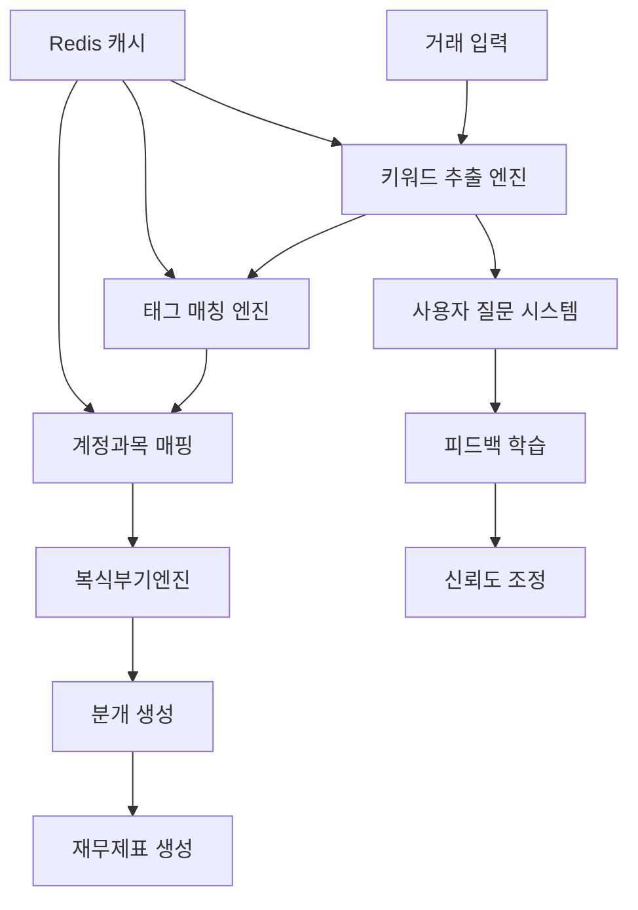

# MoneyShift Admin 종합 관리 시스템 설계서

## 📋 개요

### 시스템 목적
거래 문자열에서 키워드를 추출하고, 태그를 매칭한 후, 계정과목으로 자동 분류하는 다단계 하이브리드 엔진과 **복식부기엔진**의 효율적인 운영을 위한 통합 관리 도구

### 핵심 특징
- **다단계 처리**: 키워드 추출 → 태그 매칭 → 계정과목 도출 → 복식부기 분개 생성
- **하이브리드 엔진**: 정규식 우선, LLM 보완
- **동적 신뢰도**: 사용자 피드백 기반 자동 학습
- **Redis 캐싱**: 고성능 실시간 처리
- **통합 관리**: 룰엔진 + 복식부기엔진 + 대시보드 통합 관리

## 🏗️ 시스템 아키텍처

### 전체 처리 파이프라인


### 컴포넌트 구조
```
┌─────────────────────────────────────────────────────────────┐
│                   Admin Dashboard Frontend                   │
│                  (NextJS + React + TypeScript)             │
└──────────────────────────┬──────────────────────────────────┘
                           │
┌──────────────────────────▼──────────────────────────────────┐
│                    Spring Boot API Gateway                  │
│              (mshift-api - 포트 8080)                       │
└──────────────────────────┬──────────────────────────────────┘
                           │
        ┌──────────────────┼──────────────────┬───────────────┐
        │                  │                  │               │
┌───────▼────────┐ ┌──────▼──────┐ ┌─────────▼──────┐ ┌──────▼─────┐
│ Keyword Engine │ │Tag Engine   │ │Accounting Engine│ │ LLM Service│
│ (Pattern)      │ │ (Mapping)   │ │(Bookkeeping)   │ │(OpenAI API)│
└───────┬────────┘ └──────┬──────┘ └─────────┬──────┘ └──────┬─────┘
        │                 │                  │               │
        └──────────────────┼──────────────────┴───────────────┘
                           │
                ┌──────────▼──────────┐
                │    PostgreSQL       │
                │   (Primary DB)      │
                └──────────┬──────────┘
                           │
                ┌──────────▼──────────┐
                │    Redis Cache      │
                │  (Pattern Cache)    │
                └─────────────────────┘
```

## 🎛️ Admin 대시보드 기능

### 1. 통합 프로세스 대시보드

#### 1.1 실시간 처리 현황
```
┌─────────────────────────────────────────────────────────────┐
│              MoneyShift AI Admin Dashboard                  │
├─────────────────┬─────────────────┬─────────────────────────┤
│ Active Keywords │ Active Tags     │ Today's Transactions    │
│     3,456      │     245         │     67,890             │
├─────────────────┴─────────────────┴─────────────────────────┤
│                  Processing Pipeline Status                  │
│ ┌──────────┐    ┌──────────┐    ┌──────────┐              │
│ │ Keywords │───▶│   Tags   │───▶│ Accounts │───▶【분개】    │
│ │  87.5%   │    │  92.3%   │    │  98.1%   │    │95.2%│   │
│ └──────────┘    └──────────┘    └──────────┘    └─────┘   │
├─────────────────────────────────────────────────────────────┤
│                    Engine Performance                        │
│ Regex Success: 85.2% | LLM Fallback: 14.8%                 │
│ Avg Response: 12ms | Cache Hit Rate: 94.5%                 │
│ 복식부기 자동화율: 89.3% | 분개 생성 시간: 45ms            │
├─────────────────────────────────────────────────────────────┤
│                    Recent Activities                         │
│ • [14:30] 분개 생성: 스타벅스 → 복리후생비 ₩5,400         │
│ • [14:25] 재무제표 업데이트: 대차대조표 균형 확인          │
│ • [14:20] 질문 응답: "회식비" → 접대비로 분류             │
└─────────────────────────────────────────────────────────────┘
```

### 2. 키워드 추출 엔진 관리

#### 2.1 키워드 추출 정규식 관리
```
┌─────────────────────────────────────────────────────────────┐
│ Keyword Extraction Patterns                                  │
├─────────────────────────────────────────────────────────────┤
│ [Search: _______] [Type: All ▼] [Confidence: All ▼]        │
├─────────────────────────────────────────────────────────────┤
│□│Pattern              │Type      │Keywords  │Conf│Actions  │
├─┼────────────────────┼──────────┼──────────┼────┼─────────┤
│□│(스타벅스|스벅)      │거래처    │스타벅스   │ 95 │[✏️][🗑️] │
│□│(커피|카페|coffee)  │카테고리  │커피,카페  │ 89 │[✏️][🗑️] │
│□│(점심|저녁|식사)    │용도      │식사      │ 87 │[✏️][🗑️] │
│□│[0-9]+명           │인원      │N명       │ 92 │[✏️][🗑️] │
└─────────────────────────────────────────────────────────────┘
[Bulk Actions ▼] [+ Add Pattern] [Import] [Test All]
```

#### 2.2 키워드 추출 규칙 등록/수정
```yaml
Keyword Extraction Rule:
  Pattern Information:
    - Regex Pattern: [(정규식 입력)]
    - Pattern Type: [거래처/카테고리/용도/인원/금액범위]
    - Description: [패턴 설명]
    
  Keyword Configuration:
    - Primary Keywords: [메인 키워드들]
    - Synonyms: [동의어 목록]
    - Confidence Score: [0-100]
    - Priority: [1-100]
    
  Context Rules:
    - Time Context: [아침/점심/저녁/심야]
    - Amount Range: [최소-최대 금액]
    - Location Type: [온라인/오프라인/특정지역]
    
Test Section:
  Sample Texts:
    "(주)스타벅스커피코리아 강남역점 9,800원"
    "스벅에서 아메리카노 2잔"
    
  Extraction Results:
    ✅ Keywords: ["스타벅스", "커피", "강남"]
    ✅ Context: {time: "afternoon", amount: 9800}
```

### 3. 태그 매칭 시스템 관리

#### 3.1 키워드-태그 매핑 관리
```
┌─────────────────────────────────────────────────────────────┐
│ Keyword to Tag Mapping                                      │
├─────────────────────────────────────────────────────────────┤
│ Keyword Groups │ Mapped Tags        │ Confidence │ Usage   │
├────────────────┼────────────────────┼────────────┼─────────┤
│ 스타벅스,스벅   │ #카페, #커피전문점  │    92      │ 12,345  │
│ 커피,카페      │ #음료, #카페       │    88      │ 9,876   │
│ 점심,중식      │ #식사, #점심식사    │    90      │ 8,234   │
│ 회식,회사저녁   │ #회식비 (Q)        │    75      │ 5,432   │
└────────────────┴────────────────────┴────────────┴─────────┘
(Q) = Requires user question
[Add Mapping] [Bulk Edit] [View Unmapped Keywords]
```

#### 3.2 태그 후보 제시 설정
```
┌─────────────────────────────────────────────────────────────┐
│ Tag Suggestion Configuration                                 │
├─────────────────────────────────────────────────────────────┤
│ For Keywords: ["스타벅스", "커피"]                          │
│                                                              │
│ Tag Candidates (drag to reorder):                           │
│ 1. #카페 (confidence: 92)                                  │
│ 2. #커피전문점 (confidence: 88)                             │
│ 3. #음료 (confidence: 75)                                  │
│                                                              │
│ Presentation Rules:                                          │
│ • Show top [3] candidates                                   │
│ • Min confidence for display: [50]                          │
│ • Auto-select if confidence > [90]                         │
│                                                              │
│ Context Modifiers:                                           │
│ • Morning (06-11): +5 for #카페                            │
│ • With "회의": +10 for #회의비                             │
│ • Amount > 50,000: +5 for #회식비                         │
│                                                              │
│ [Save Configuration] [Test with Sample]                      │
└─────────────────────────────────────────────────────────────┘
```

### 4. 계정과목 매핑 관리

#### 4.1 태그-계정과목 (N:1) 매핑
```
┌─────────────────────────────────────────────────────────────┐
│ Tag to Account Code Mapping (N:1)                          │
├─────────────────────────────────────────────────────────────┤
│ Tags                    │ Account Code    │ Conditions      │
├─────────────────────────┼─────────────────┼─────────────────┤
│ #카페, #커피전문점       │ 복리후생비(5201) │ Default         │
│ #카페, #커피전문점       │ 접대비(5101)    │ If "거래처"     │
│ #회식비                │ 복리후생비(5201) │ If "직원"       │
│ #회식비                │ 접대비(5101)    │ If "고객"       │
│ #택시, #교통           │ 여비교통비(5301) │ Default         │
│ #택시                  │ 접대비(5101)    │ If 심야+회식    │
└─────────────────────────┴─────────────────┴─────────────────┘
[Add Mapping] [Edit Conditions] [Test Scenarios]
```

#### 4.2 조건부 매핑 규칙 설정
```
┌─────────────────────────────────────────────────────────────┐
│ Conditional Mapping Rules                                    │
├─────────────────────────────────────────────────────────────┤
│ Tag: #택시                                                  │
│                                                              │
│ Rule Priority:                                               │
│ 1. IF time = "late_night" AND previous_tag = "#회식비"      │
│    THEN account = "접대비(5101)"                           │
│                                                              │
│ 2. IF amount > 50000                                        │
│    THEN account = "접대비(5101)"                           │
│                                                              │
│ 3. IF keywords contain "출장"                               │
│    THEN account = "여비교통비(5301)"                       │
│                                                              │
│ 4. DEFAULT                                                  │
│    THEN account = "여비교통비(5301)"                       │
│                                                              │
│ [Add Rule] [Test Rules] [Reorder] [View Statistics]         │
└─────────────────────────────────────────────────────────────┘
```

## 🆕 복식부기엔진 통합 관리

### 5. 복식부기 엔진 관리 화면

#### 5.1 분개 생성 모니터링
```
┌─────────────────────────────────────────────────────────────┐
│ 복식부기엔진 대시보드                                        │
├─────────────────────────────────────────────────────────────┤
│ 📊 실시간 분개 현황                                         │
│ ├ 오늘 생성된 분개: 1,247건                                │
│ ├ 자동 승인: 1,115건 (89.4%)                              │
│ ├ 검토 필요: 132건 (10.6%)                                 │
│ └ 평균 처리 시간: 45ms                                     │
│                                                              │
│ ⚖️ 대차평균 검증 현황                                        │
│ ├ 균형 분개: 1,243건 (99.7%)                              │
│ ├ 불균형 분개: 4건 (0.3%) ⚠️                              │
│ └ 자동 수정: 2건                                           │
│                                                              │
│ 📈 재무제표 생성 현황                                       │
│ ├ 대차대조표: 업데이트됨 (14:30)                           │
│ ├ 손익계산서: 업데이트됨 (14:30)                           │
│ └ 다음 업데이트: 15:00 (30분 간격)                         │
└─────────────────────────────────────────────────────────────┘
```

#### 5.2 분개 상세 관리
```
┌─────────────────────────────────────────────────────────────┐
│ Journal Entry Detail Management                             │
├─────────────────────────────────────────────────────────────┤
│ Transaction: "스타벅스 강남점 15,600원"                      │
│                                                              │
│ Generated Journal Entry:                                     │
│ ┌─────────────────┬──────────┬──────────┐                  │
│ │ Account         │ Debit    │ Credit   │                  │
│ ├─────────────────┼──────────┼──────────┤                  │
│ │ 복리후생비(5201) │ 15,600   │    -     │                  │
│ │ 보통예금(1120)   │    -     │ 15,600   │                  │
│ └─────────────────┴──────────┴──────────┘                  │
│ ✅ Balance Check: OK (15,600 = 15,600)                     │
│                                                              │
│ AI Processing Info:                                          │
│ • Method: TAG_MAPPING                                       │
│ • Confidence: 92%                                           │
│ • Processing Time: 45ms                                     │
│                                                              │
│ [Edit Entry] [Approve] [Reject] [View Similar]             │
└─────────────────────────────────────────────────────────────┘
```

#### 5.3 계정과목 마스터 관리
```
┌─────────────────────────────────────────────────────────────┐
│ Chart of Accounts Management                                │
├─────────────────────────────────────────────────────────────┤
│ [Search: _______] [Type: All ▼] [Active: Yes ▼]           │
├─────────────────────────────────────────────────────────────┤
│Code │ Name        │ Type │ Subtype    │ Dr/Cr │ Parent  │Act│
├─────┼─────────────┼──────┼────────────┼───────┼─────────┼───┤
│1110 │ 현금        │ 자산 │ 유동자산   │  Dr   │    -    │ ✓ │
│1120 │ 보통예금    │ 자산 │ 유동자산   │  Dr   │    -    │ ✓ │
│2110 │ 미지급금    │ 부채 │ 유동부채   │  Cr   │    -    │ ✓ │
│5101 │ 접대비      │ 비용 │ 판관비     │  Dr   │    -    │ ✓ │
│5201 │ 복리후생비  │ 비용 │ 판관비     │  Dr   │    -    │ ✓ │
└─────┴─────────────┴──────┴────────────┴───────┴─────────┴───┘
[+ Add Account] [Import] [Export] [Hierarchy View]
```

### 6. 사용자 질문 관리

#### 6.1 질문 템플릿 설정
```
┌─────────────────────────────────────────────────────────────┐
│ User Question Configuration                                  │
├─────────────────────────────────────────────────────────────┤
│ Trigger Conditions:                                          │
│ • Tag: #회식비                                              │
│ • Keywords: ["회식", "회사저녁", "팀저녁"]                  │
│ • Confidence: < 85                                          │
│                                                              │
│ Question Template:                                           │
│ "이 거래는 어떤 목적의 식사였나요?"                          │
│                                                              │
│ Answer Options:                                              │
│ ┌─────────────────────────────────────┐                    │
│ │ 1. 직원 회식 → 복리후생비(5201)    │ [↑][↓][✏️][🗑️]    │
│ │ 2. 거래처 접대 → 접대비(5101)      │ [↑][↓][✏️][🗑️]    │
│ │ 3. 부서 회의 → 회의비(5401)       │ [↑][↓][✏️][🗑️]    │
│ │ 4. 기타 → 기타비용(5901)          │ [↑][↓][✏️][🗑️]    │
│ └─────────────────────────────────────┘                    │
│                                                              │
│ Learning Rules:                                              │
│ • Option selected → Confidence +1                           │
│ • Option 1 selected 10 times → Auto-approve                │
│ • Option order auto-adjusts based on selection frequency    │
│                                                              │
│ [Save Question] [Preview] [View Response Stats]             │
└─────────────────────────────────────────────────────────────┘
```

### 7. 신뢰도 관리 시스템

#### 7.1 신뢰도 점수 모니터링
```
┌─────────────────────────────────────────────────────────────┐
│ Confidence Score Management                                  │
├─────────────────────────────────────────────────────────────┤
│ Score Distribution:                                          │
│ ┌────────────────────────────────────────────────┐         │
│ │ 90-100: ████████████████ (1,234 rules)        │         │
│ │ 80-89:  ███████████ (987 rules)               │         │
│ │ 70-79:  ████████ (654 rules)                  │         │
│ │ 60-69:  ████ (321 rules)                      │         │
│ │ < 60:   ██ (123 rules) ⚠️                     │         │
│ └────────────────────────────────────────────────┘         │
│                                                              │
│ Automatic Adjustment Rules:                                  │
│ • User accepts suggestion: +1 point                         │
│ • User rejects suggestion: -2 points                        │
│ • Pattern match success: +0.5 points                        │
│ • LLM fallback needed: -1 point                            │
│ • 분개 자동 승인: +1 point                                  │
│ • 분개 수정 필요: -1 point                                  │
│                                                              │
│ Thresholds:                                                  │
│ • Auto-approve: >= 90                                       │
│ • Show question: 70-89                                      │
│ • LLM fallback: < 70                                        │
│                                                              │
│ [Edit Rules] [Reset Scores] [Export Report]                 │
└─────────────────────────────────────────────────────────────┘
```

### 8. LLM 통합 관리

#### 8.1 LLM 폴백 설정
```
┌─────────────────────────────────────────────────────────────┐
│ LLM Fallback Configuration                                  │
├─────────────────────────────────────────────────────────────┤
│ Trigger Conditions:                                          │
│ • No keyword extracted                                      │
│ • No matching tags found                                    │
│ • All tag confidences < 70                                  │
│ • User explicitly requests                                  │
│ • 분개 생성 실패                                            │
│                                                              │
│ LLM Settings:                                               │
│ • Model: [GPT-4o ▼] [Claude-3 ▼]                          │
│ • Temperature: [0.3] (0.0 - 1.0)                           │
│ • Max tokens: [150]                                         │
│ • Timeout: [3000ms]                                         │
│                                                              │
│ Prompt Template:                                             │
│ ┌─────────────────────────────────────────────────┐        │
│ │ 거래: {transaction_text}                        │        │
│ │ 금액: {amount}                                  │        │
│ │ 시간: {timestamp}                               │        │
│ │                                                 │        │
│ │ 위 거래에서:                                    │        │
│ │ 1. 핵심 키워드 추출                             │        │
│ │ 2. 적절한 태그 제안 (최대 3개)                  │        │
│ │ 3. 계정과목 추천                                │        │
│ │ 4. 분개 구조 제안 (차변/대변)                   │        │
│ └─────────────────────────────────────────────────┘        │
│                                                              │
│ Auto Rule Creation:                                          │
│ • Create rule after [10] consistent LLM responses           │
│ • Initial confidence: [70]                                  │
│                                                              │
│ [Save Settings] [Test LLM] [View Usage Stats]               │
└─────────────────────────────────────────────────────────────┘
```

### 9. Redis 캐시 관리

#### 9.1 캐시 모니터링
```
┌─────────────────────────────────────────────────────────────┐
│ Redis Cache Dashboard                                        │
├─────────────────────────────────────────────────────────────┤
│ Cache Statistics:                                            │
│ • Total Keys: 145,678                                       │
│ • Memory Usage: 2.3GB / 8GB (28.75%)                       │
│ • Hit Rate: 94.5%                                           │
│ • Avg Response Time: 0.3ms                                  │
│                                                              │
│ Cache Distribution:                                          │
│ • Keyword Patterns: 45,234 keys                             │
│ • Tag Mappings: 32,456 keys                                 │
│ • Account Mappings: 28,901 keys                             │
│ • Journal Entries: 15,234 keys (신규)                      │
│ • Transaction Results: 39,087 keys                          │
│                                                              │
│ TTL Configuration:                                           │
│ • Patterns: No expiry                                       │
│ • Mappings: No expiry                                       │
│ • Journal Entries: 1 hour                                   │
│ • Results: 24 hours                                         │
│                                                              │
│ [Flush Cache] [Reload Patterns] [View Details]              │
└─────────────────────────────────────────────────────────────┘
```

### 10. 테스트 및 검증

#### 10.1 통합 테스트 도구
```
┌─────────────────────────────────────────────────────────────┐
│ End-to-End Testing Suite                                    │
├─────────────────────────────────────────────────────────────┤
│ Test Scenario: "Coffee Meeting"                              │
│                                                              │
│ Input Transaction:                                           │
│ "스타벅스 강남점 아메리카노 4잔 15,600원"                    │
│                                                              │
│ Processing Steps:                                            │
│ 1. Keyword Extraction ✅                                    │
│    → Keywords: ["스타벅스", "커피", "4잔", "강남"]         │
│                                                              │
│ 2. Tag Matching ✅                                          │
│    → Suggested Tags: [#카페(92%), #회의비(78%)]            │
│                                                              │
│ 3. User Question ⚠️                                         │
│    → "이 커피는 어떤 목적이었나요?"                         │
│    → Options: [회의용, 개인용, 접대용]                      │
│                                                              │
│ 4. Account Mapping ✅                                       │
│    → If 회의용: 회의비(5401)                               │
│    → If 접대용: 접대비(5101)                               │
│                                                              │
│ 5. Journal Entry Generation ✅ (신규)                      │
│    → Dr. 회의비 15,600 / Cr. 보통예금 15,600               │
│                                                              │
│ 6. Balance Sheet Update ✅ (신규)                          │
│    → 자산(-15,600), 비용(+15,600)                          │
│                                                              │
│ [Run Test] [Save Scenario] [Export Results]                 │
└─────────────────────────────────────────────────────────────┘
```

## 🗄️ 확장된 데이터베이스 스키마

### 기존 스키마 + 복식부기 확장
```sql
-- 기존 키워드/태그 테이블들은 그대로 유지

-- 회계 계정과목 마스터 테이블 (신규)
CREATE TABLE chart_of_accounts (
    id SERIAL PRIMARY KEY,
    account_code VARCHAR(10) NOT NULL UNIQUE,
    account_name VARCHAR(100) NOT NULL,
    account_type account_type_enum NOT NULL,
    account_subtype VARCHAR(50),
    is_debit_normal BOOLEAN NOT NULL,
    parent_account_id INTEGER REFERENCES chart_of_accounts(id),
    is_active BOOLEAN DEFAULT true,
    display_order INTEGER DEFAULT 0,
    created_at TIMESTAMPTZ DEFAULT NOW(),
    updated_at TIMESTAMPTZ DEFAULT NOW()
);

-- 분개 마스터 테이블 (신규)
CREATE TABLE journal_entries (
    id BIGSERIAL PRIMARY KEY,
    company_id UUID NOT NULL,
    entry_date DATE NOT NULL,
    description TEXT NOT NULL,
    reference_type VARCHAR(50) DEFAULT 'TRANSACTION',
    reference_id BIGINT,
    total_amount BIGINT NOT NULL,
    status journal_entry_status_enum DEFAULT 'DRAFT',
    created_by VARCHAR(100),
    created_at TIMESTAMPTZ DEFAULT NOW(),
    updated_at TIMESTAMPTZ DEFAULT NOW()
);

-- 분개 상세 테이블 (신규)
CREATE TABLE journal_entry_details (
    id BIGSERIAL PRIMARY KEY,
    journal_entry_id BIGINT REFERENCES journal_entries(id) ON DELETE CASCADE,
    line_number INTEGER NOT NULL,
    account_code VARCHAR(10) NOT NULL,
    debit_amount BIGINT DEFAULT 0,
    credit_amount BIGINT DEFAULT 0,
    description TEXT,
    created_at TIMESTAMPTZ DEFAULT NOW()
);

-- 재무제표 저장 테이블 (신규)
CREATE TABLE financial_statements (
    id BIGSERIAL PRIMARY KEY,
    company_id UUID NOT NULL,
    statement_type financial_statement_type_enum NOT NULL,
    period_start DATE NOT NULL,
    period_end DATE NOT NULL,
    statement_data JSONB NOT NULL,
    generation_status financial_generation_status_enum DEFAULT 'GENERATING',
    created_at TIMESTAMPTZ DEFAULT NOW(),
    updated_at TIMESTAMPTZ DEFAULT NOW()
);

-- 기존 거래 로그 테이블 확장
ALTER TABLE transaction_logs ADD COLUMN journal_entry_id BIGINT REFERENCES journal_entries(id);
ALTER TABLE transaction_logs ADD COLUMN bookkeeping_confidence INTEGER;
ALTER TABLE transaction_logs ADD COLUMN balance_check_passed BOOLEAN;

-- 인덱스 생성
CREATE INDEX idx_journal_entries_company ON journal_entries(company_id);
CREATE INDEX idx_journal_entries_date ON journal_entries(entry_date);
CREATE INDEX idx_journal_entry_details_journal ON journal_entry_details(journal_entry_id);
CREATE INDEX idx_journal_entry_details_account ON journal_entry_details(account_code);
```

## 🎯 API 설계

### 기존 API + 복식부기 확장
```yaml
# 기존 키워드/태그 API들은 그대로 유지

# 복식부기엔진 API (신규)
POST   /api/v2/accounting/process-transaction
GET    /api/v2/accounting/journal-entries
GET    /api/v2/accounting/journal-entry/{id}
PUT    /api/v2/accounting/journal-entry/{id}
DELETE /api/v2/accounting/journal-entry/{id}

# 계정과목 관리 API (신규)
GET    /api/v2/accounting/chart-of-accounts
POST   /api/v2/accounting/chart-of-accounts
PUT    /api/v2/accounting/chart-of-accounts/{id}
DELETE /api/v2/accounting/chart-of-accounts/{id}

# 재무제표 생성 API (신규)
POST   /api/v2/accounting/generate-balance-sheet
POST   /api/v2/accounting/generate-income-statement
GET    /api/v2/accounting/financial-statements
POST   /api/v2/accounting/financial-statements/{id}/regenerate

# 시스템 상태 API (신규)
GET    /api/v2/accounting/health
GET    /api/v2/accounting/stats
GET    /api/v2/accounting/balance-validation

# 통합 대시보드 API (확장)
GET    /api/v1/analytics/integrated-dashboard
GET    /api/v1/analytics/processing-pipeline
GET    /api/v1/analytics/bookkeeping-performance
```

## 📊 성능 및 모니터링

### 핵심 메트릭 (확장)
- **기존 메트릭**: 키워드 추출률, 태그 매칭률, LLM 사용률
- **신규 메트릭**: 
  - 분개 생성 성공률 (목표: >95%)
  - 분개 자동 승인율 (목표: >85%)
  - 대차평균 정확도 (목표: 100%)
  - 재무제표 생성 시간 (목표: <2초)
  - 통합 처리 시간 (목표: <100ms)

### 알림 조건 (확장)
- 분개 생성 실패율 > 5%: CRITICAL
- 대차불균형 발생: CRITICAL
- 복식부기 처리 시간 > 200ms: WARNING
- 재무제표 생성 실패: CRITICAL

## 🚀 개발 로드맵

### Phase 1: 통합 대시보드 (4주)
- [x] 기존 룰엔진 대시보드 현행화
- [ ] 복식부기엔진 대시보드 통합
- [ ] 통합 처리 파이프라인 시각화
- [ ] 실시간 모니터링 체계 구축

### Phase 2: 복식부기 관리 기능 (6주)
- [ ] 분개 생성 관리 화면
- [ ] 계정과목 마스터 관리
- [ ] 재무제표 생성 관리
- [ ] 대차평균 검증 시스템

### Phase 3: 통합 최적화 (4주)
- [ ] 성능 최적화 (캐시 확장)
- [ ] 오류 처리 시스템 강화
- [ ] 자동 학습 시스템 고도화
- [ ] 사용자 경험 개선

### Phase 4: 고급 기능 (6주)
- [ ] 예측 분석 대시보드
- [ ] 이상 거래 자동 감지
- [ ] 세무 최적화 제안
- [ ] 멀티 테넌트 지원

## 🔐 보안 및 컴플라이언스

### 보안 요구사항 (확장)
- **기존**: OAuth 2.0 + JWT, RBAC, 감사 로깅
- **신규**: 
  - 분개 데이터 무결성 보장
  - 재무제표 변경 이력 추적
  - 계정과목 변경 승인 체계
  - 대차대조표 균형 자동 검증

### 컴플라이언스 (확장)
- **전자장부보존법**: 분개장 5년 보관
- **법인세법**: 적절한 계정과목 분류
- **회계기준**: 복식부기 원칙 준수
- **내부통제**: 분개 생성 프로세스 문서화

---

## 결론

이 통합 관리 시스템은 기존의 키워드 기반 태깅 시스템에 복식부기엔진을 완전히 통합하여, **거래 분류부터 재무제표 생성까지의 전체 회계 프로세스**를 하나의 Admin 도구에서 관리할 수 있는 포괄적인 솔루션을 제공합니다.

**핵심 가치:**
1. **통합 관리**: 룰엔진 + 복식부기엔진 + 대시보드 일원화
2. **실시간 모니터링**: 전체 파이프라인 상태 실시간 추적
3. **자동화 확장**: AI 기반 학습으로 지속적인 정확도 향상
4. **완전성**: 거래 → 분개 → 재무제표까지 완전 자동화

완성 시 소규모 법인 사용자들은 복잡한 회계 업무를 AI가 자동으로 처리하고, 관리자는 하나의 대시보드에서 모든 것을 모니터링하고 제어할 수 있는 혁신적인 통합 시스템을 얻게 됩니다.